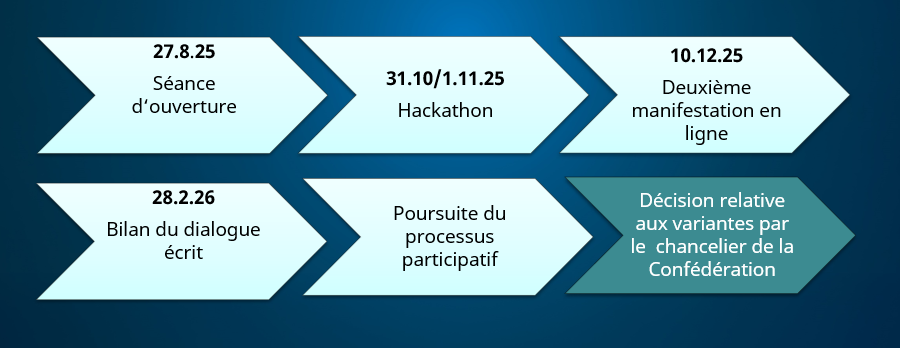
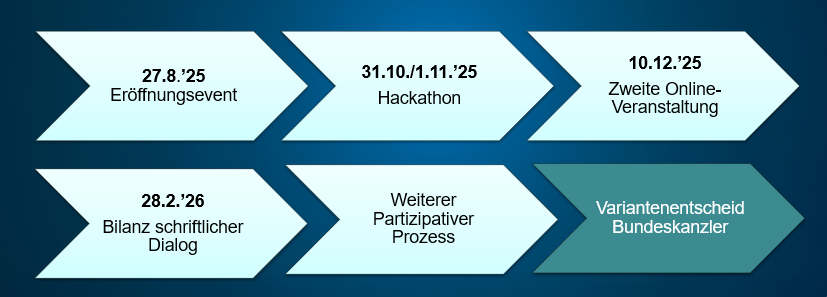

_[Deutsche Version](#d0-0)_

# Français : Plateforme E-Collecting

**Table des matières**

* [Introduction à la platforme](#f1-0)
* [Actualités](#f2-0)
* [Nécessité de discuter des variantes de mise en œuvre de l'E-Collecting](#f3-0)
* [Chronologie](#f4-0)
* [Documentation](#f5-0)
  * [Document du processus participatif à l’E-Collecting](#f5-1)
  * [Autres documents sur l’E-Collecting](#f5-2)

## <a name="f1-0">Introduction à la plateforme</a>

L'E-Collecting désigne un processus numérique allant du soutien à une initiative populaire par sa propre signature au comptage des signatures reçues.
Pour en savoir plus, rendez-vous sur le [Site Web de la Chancellerie fédérale](https://www.bk.admin.ch/bk/fr/home/droits-politiques/e-collecting.html). 

Le Parlement a chargé le Conseil fédéral de mener des essais dans le domaine de la collecte électronique. Il a confié la direction du projet à la Chancellerie fédérale, laquelle a lancé un processus participatif dans ce but. Elle poursuit ainsi l'objectif de recenser, de décrire et de discuter les questions importantes et les différentes variantes de mise en œuvre.

La plateforme E-Collecting sert à discuter des essais menés sur le E-Collecting et des différentes variantes possibles de mise en œuvre.

La plateforme est ouverte à toutes les personnes intéressées et les invite dès lors à étudier les documents et à participer aux discussions.

La présentation de la plateforme dans le navigateur diffère des normes habituelles. C'est pourquoi un [mode d'emploi](https://github.com/swiss/e-collecting/blob/main/docs/admin/github-tutorial.md) séparé est disponible.

La Chancellerie fédérale informe régulièrement quelles sont les nouveautés relatives au processus participatif dans sa newsletter E-Collecting. [Inscription](https://www.bk.admin.ch/bk/fr/home/droits-politiques/e-collecting/newsletter.html) 

## <a name="f2-0">Actualités</a>

La deuxième manifestation participative aura lieu le 10.12.2025: [Teams-Link](https://teams.microsoft.com/meet/37248906692933?p=0RKV9LClB8eNwGx4MB) 

[Ici](https://www.bk.admin.ch/bk/fr/home/droits-politiques/e-collecting/partizipativer_prozess.html) le lien vers la présentation de l’événement. 

## <a name="f3-0">Nécessité de discuter des variantes de mise en œuvre de l'E-Collecting</a>

Les discussions portent actuellement sur les thèmes suivants :

* À quels endroits l'équilibre politique se manifeste-t-il ? ([Discussion Équilibre politique - Question 1](https://github.com/swiss/e-collecting/issues/1)). 
* Peut-on vraiment se passer d'une option de refus concernant le processus papier ? ([Discussion Option de refus - Question 2](https://github.com/swiss/e-collecting/issues/1)). 

Une liste complète de ces discussions et des autres discussions prévues seront publiées dans les prochains jours.

## <a name="f4-0">Chronologie</a>

_Description de l'image : représentation graphique du calendrier avec les étapes suivantes : événement d'ouverture, hackathon, 2e événement en ligne, bilan du dialogue écrit, poursuite du processus participatif et décision du chancelier fédéral sur les variantes_

## <a name="f5-0">Documentation</a>

### <a name="f5-1">Document du processus participatif à l’E-Collecting</a>

* Rapport de postulat E-Collecting  (2024-11-20): [PDF](https://www.newsd.admin.ch/newsd/message/attachments/90667.pdf)
* Révision partielle de la loi fédérale sur les droits politiques avec nouvelle norme expérimentale relative à la collecte électronique (30 avril 2025): [Webseite](https://www.news.admin.ch/fr/newnsb/oAsAOWHCOpvBMZavKcq_e)
* Événement inaugural du processus participatif (27 août 2025): [Video](https://www.youtube.com/watch?v=WGUTi2jSaYw) / [Slides]((https://www.news.admin.ch/fr/newnsb/oAsAOWHCOpvBMZavKcq_e)
* Guide pour participer au hackathon E-Collecting (23/10/2025): [PDF]((https://www.bk.admin.ch/dam/bk/fr/dokumente/pore/e-collecting/hackathon2025/E-Collecting%20Hackathon%20guide.pdf.download.pdf/E-Collecting%20Hackathon%20guide.pdf)
* Hackathon E-Collecting avec plusieurs solutions (31/10/2025-01/11/2025): [Webseite](https://www.github.com/swiss/e-collecting-hackathon)

### <a name="f5-2">Autres documents sur l’E-Collecting</a>

Une liste complète des documents est disponible dans un fichier séparé. [Liste](docs/admin/document-list.md).

# <a name="d0-0">Deutsch: E-Collecting-Plattform</a>

**Inhaltsverzeichnis**

* [Einführung zur Plattform](#d1-0)
* [Aktuell](#d2-0)
* [Diskussionbedarf für die E-Collecting Umsetzungsvarianten](#d3-0)
* [Timeline](#d4-0)
* [Dokumente](#d5-0)
  * [Dokumente des partizipativen Prozesses E-Collecting](#d5-1)
  * [Weitere Dokumente zu E-Collecting](#d5-2)

## <a name="d1-0">Einführung zur Plattform</a>

E-Collecting bezeichnet ein digitales Verfahren, das von der Unterstützung eines Volksbegehrens durch die eigene Unterschrift bis zur Zählung der eingegangenen Unterschriften reicht.

Mehr dazu auf der [Webseite der Bundeskanzlei](https://www.bk.admin.ch/bk/de/home/politische-rechte/e-collecting.html).

Das Parlament hat den Bundesrat mit Versuchen mit E-Collecting beauftragt. Er hat die Federführung der 
Bundeskanzlei übertragen. Sie hat dazu einen partizipativen Prozess lanciert. Damit verfolgt sie das Ziel,
die wichtigen Fragen und die verschiedenen Umsetzungsvarianten zu erheben, zu beschreiben und zu besprechen.

Die E-Collecting Plattform dient der Diskussion zu den E-Collecting Versuchen und den möglichen Umsetzungsvarianten.

Die Plattform steht allen Interessierten offen und lädt dazu ein, die Unterlagen zu
studieren und sich in die Diskussionen einzubringen.

Die Darstellung der Plattform im Browser weicht von gängigen Standards ab. Es steht
deshalb eine separate [Anleitung zur Verfügung](docs/admin/github-tutorial.md).

Die Bundeskanzlei informiert mit ihrem E-Collecting Newsletter regelmässig über Neuigkeiten zum partizipativen Prozess. [Registration](https://www.bk.admin.ch/bk/de/home/politische-rechte/e-collecting/newsletter.html)

## <a name="d2-0">Aktuell</a>

Die 2. Partizipationsveranstaltung 10.12.2025: [Teams-Link](https://teams.microsoft.com/l/meetup-join/19%3ameeting_NmFmNThmMTEtNjY3OS00YTMxLTg5ODgtNGI2NzdkM2EyNzk5%40thread.v2/0?context=%7b%22Tid%22%3a%226ae27add-8276-4a38-88c1-3a9c1f973767%22%2c%22Oid%22%3a%227887f44d-8227-43b2-9c01-25317146e9e3%22%7d)

[Hier](https://www.bk.admin.ch/bk/de/home/politische-rechte/e-collecting/partizipativer_prozess.html) der Link zur Präsentation der Veranstaltung.

## <a name="d3-0">Diskussionbedarf für die E-Collecting Umsetzungsvarianten</a>

Zur Zeit laufen die Diskussionen zu folgenden Themen:

* An welchen Orten manifestiert sich die politische Ausgewogenheit? ([Diskussion Politische-Ausgewogenheit - Issue 1](https://github.com/swiss/e-collecting/issues/1))
* Lässt sich wirklich auf einen Opt-Out für den Papierprozess verzichten? ([Diskussion Opt-Out - Issue 2](https://github.com/swhttps://github.com/swiss/e-collecting/issues/1iss/e-collecting/issues/2))

Eine umfassende Liste dieser und weiterer geplanter Diskussionen wird in den nächsten Tagen publiziert werden.

## <a name="d4-0">Timeline</a>

_Bildbeschreibung: Grafische Darstellung der Timeline mit den Stationen Eröffnungsevent, Hackathon, 2. Online-Veranstaltung, Bilanz schriftlicher Dialog, weiterer partizipativer Prozess und Variantenentscheid Bundeskanzler_

## <a name="d5-0">Dokumente</a>

### <a name="d5-1">Dokumente des partizipativen Prozesses E-Collecting</a>

* Postulatsbericht E-Collecting (2024-11-20): [PDF]((https://www.bk.admin.ch/dam/bk/fr/dokumente/pore/e-collecting/rapport%20en%20r%C3%A9ponse%20au%20postulat%20e-collecting.pdf.download.pdf/rapport%20en%20r%C3%A9ponse%20au%20postulat%20e-collecting.pdf))
* Teilrevision des Bundesgesetzes über die politischen Recht mit neuer E-Collecting Versuchsnorm (2025-04-30): [Webseite](https://www.news.admin.ch/de/newnsb/oAsAOWHCOpvBMZavKcq_e)
* Eröffnungsveranstaltung des partizipativen Prozesses (2025-08-27):  [Video](https://www.youtube.com/watch?v=WGUTi2jSaYw) / [Slides](https://www.bk.admin.ch/bk/de/home/politische-rechte/e-collecting/partizipativer_prozess.html#accordion1765290960539)
* Leitfaden für Teilnahme am E-Collecting Hackathon (2025-10-23): [PDF](https://www.bk.admin.ch/dam/bk/de/dokumente/pore/E-Collecting/hackathon2025/E-Collecting%20Hackathon%20Leitfaden.pdf.download.pdf/E-Collecting%20Hackathon%20Leitfaden.pdf)
* E-Collecting Hackathon mit Lösungsvarianten (2025-10-31/2025-11-01): [Webseite](https://www.github.com/swiss/e-collecting-hackathon)

### <a name="d5-2">Weitere Dokumente zu E-Collecting</a>

Ein umfassenderess Verzeichnis mit Dokumenten findet sich auf einer separaten [Liste](docs/admin/document-list.md).

