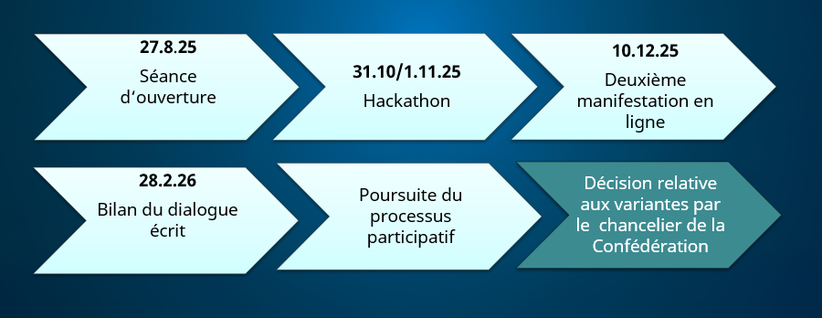
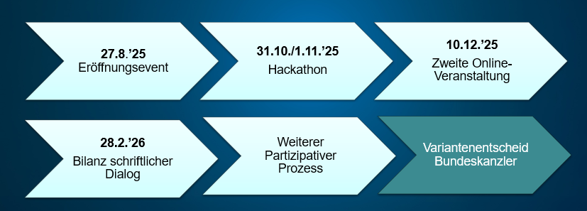

_[Deutsche Version](#d0-0)_

# Français : Plateforme E-Collecting

**Table des matières**

* [Introduction à la platforme](#f1-0)
* [Actualités- 🗨️ Les discussions en cours 🗨️](#f2-0)
* [Chronologie](#f4-0)
* [Documentation](#f5-0)
  * [Document du processus participatif à l’E-Collecting](#f5-1)
  * [Autres documents sur l’E-Collecting](#f5-2)

## <a name="f1-0">Introduction à la plateforme</a>

L'E-Collecting désigne un processus numérique allant du soutien à une initiative populaire par sa propre signature au comptage des signatures reçues.
Pour en savoir plus, rendez-vous sur le [Site Web de la Chancellerie fédérale](https://www.bk.admin.ch/bk/fr/home/droits-politiques/e-collecting.html). 

Le Parlement a chargé le Conseil fédéral de mener des essais dans le domaine de la collecte électronique. Il a confié la direction du projet à la Chancellerie fédérale, laquelle a lancé un processus participatif dans ce but. Elle poursuit ainsi l'objectif de recenser, de décrire et de discuter les questions importantes et les différentes variantes de mise en œuvre.

La plateforme E-Collecting sert à discuter des essais menés sur le E-Collecting et des différentes variantes possibles de mise en œuvre.

La plateforme est ouverte à toutes les personnes intéressées et les invite dès lors à étudier les documents et à participer aux discussions.

La présentation de la plateforme dans le navigateur diffère des normes habituelles. C'est pourquoi un [mode d'emploi](https://github.com/swiss/e-collecting/blob/main/docs/admin/github-tutorial.md) séparé est disponible.

La Chancellerie fédérale informe régulièrement quelles sont les nouveautés relatives au processus participatif dans sa newsletter E-Collecting. [Inscription](https://www.bk.admin.ch/bk/fr/home/droits-politiques/e-collecting/newsletter.html) 

## <a name="f2-0">Actualités- 🗨️ Les discussions en cours 🗨️</a>

Au cours de la première phase du dialogue en ligne, nous avons abordé six questions. Nous avons rassemblé et synthétisé les différents arguments et points de vue à la mi-mars 2026. Nous vous invitons à nous signaler toute erreur ou omission dans ce travail.

[Synthèse des différents arguments et positions issus du dialogue en ligne jusqu'à la mi-mars 2026](https://github.com/swiss/e-collecting/blob/main/docs/summaries/first-summary-online-dialogue.md#r%C3%A9sum%C3%A9-des-arguments-de-la-premi%C3%A8re-phase-du-dialogue-en-ligne-au-17-mars-2026)

La liste des discussions :

* À quels endroits l'équilibre politique se manifeste-t-il ? ([Discussion Équilibre politique - Issue 1](https://github.com/swiss/e-collecting/issues/1) / [Synthèse](https://github.com/swiss/e-collecting/blob/main/docs/summaries/first-summary-online-dialogue.md#discussion-1--%C3%A9quilibre-politique)) 
* Peut-on vraiment se passer d'une option de refus concernant le processus papier ? ([Discussion Option de refus - Issue 2](https://github.com/swiss/e-collecting/issues/2) / [Synthèse](https://github.com/swiss/e-collecting/blob/main/docs/summaries/first-summary-online-dialogue.md#discussion-2--est-il-vraiment-possible-d%C3%A9viter-de-se-retirer-du-processus-papier-))
* Les collections en cours doivent-elles être présentées et, si oui, comment ? ([Présentation des récoltes en cours - Issue 3](https://github.com/swiss/e-collecting/issues/3) / [Synthèse](https://github.com/swiss/e-collecting/blob/main/docs/summaries/first-summary-online-dialogue.md#discussion-3--pr%C3%A9sentation-des-r%C3%A9coltes-en-cours-))
* Quelles menaces sont envisageables ? ([Discussion Menaces - Issue 4](https://github.com/swiss/e-collecting/issues/4) / [Synthèse](https://github.com/swiss/e-collecting/blob/main/docs/summaries/first-summary-online-dialogue.md#discussion-4--menaces))
* Quelle est la priorité : la sécurité ou un démarrage aussi rapide que possible ? ([Discussion Sécurité et vitesse - Issue 5](https://github.com/swiss/e-collecting/issues/5) / [Synthèse](https://github.com/swiss/e-collecting/blob/main/docs/summaries/first-summary-online-dialogue.md#discussion-5--s%C3%A9curit%C3%A9-et-vitesse-))
* L'attribution des déclarations de soutien est-elle nécessaire ? ([Discussion L'Attribution des déclaration de soutien - Issue 6](https://github.com/swiss/e-collecting/issues/6) / [Synthèse](https://github.com/swiss/e-collecting/blob/main/docs/summaries/first-summary-online-dialogue.md#discussion-6--attribution-des-d%C3%A9clarations-de-soutien)) 

## <a name="f4-0">Chronologie</a>

_Description de l'image : représentation graphique du calendrier avec les étapes suivantes : événement d'ouverture, hackathon, 2e événement en ligne, bilan du dialogue écrit, poursuite du processus participatif et décision du chancelier fédéral sur les variantes_

## <a name="f5-0">Documentation</a>

### <a name="f5-1">Document du processus participatif à l’E-Collecting</a>

* Rapport de postulat E-Collecting  (2024-11-20): [PDF](https://www.newsd.admin.ch/newsd/message/attachments/90667.pdf)
* Révision partielle de la loi fédérale sur les droits politiques avec nouvelle norme expérimentale relative à la récolte électronique (30 avril 2025): [Site web](https://www.news.admin.ch/fr/newnsb/oAsAOWHCOpvBMZavKcq_e)
* Événement inaugural du processus participatif (27 août 2025): [Video](https://www.youtube.com/watch?v=WGUTi2jSaYw) / [Diapositives](https://www.news.admin.ch/fr/newnsb/oAsAOWHCOpvBMZavKcq_e) / [Résumé des discussions](https://github.com/swiss/e-collecting/blob/main/docs/summaries/summary-1st-online-event.md) / [Transcript IA](https://github.com/swiss/e-collecting/blob/main/docs/transcripts/2025-08-27-1st-participation-event-ai-transcript.md) 
* Guide pour participer au hackathon E-Collecting (23/10/2025): [PDF](https://www.bk.admin.ch/dam/bk/fr/dokumente/pore/e-collecting/hackathon2025/E-Collecting%20Hackathon%20guide.pdf.download.pdf/E-Collecting%20Hackathon%20guide.pdf) / [Liste des "topics" du hackathon](https://github.com/swiss/e-collecting/blob/main/docs/base-documents/hackathon-topics.md)
* Hackathon E-Collecting avec plusieurs solutions (31/10/2025-01/11/2025): [Site web](https://www.github.com/swiss/e-collecting-hackathon)
* 2e événement en ligne du processus participatif (2025-12-10): [Diapositives](https://www.bk.admin.ch/dam/bk/it/dokumente/pore/e-collecting/Pr%C3%A9sentation%20E-Collecting%20-%20Deuxi%C3%A8me%20manifestation%20en%20ligne.pdf.download.pdf/Pr%C3%A9sentation%20E-Collecting%20-%20Deuxi%C3%A8me%20manifestation%20en%20ligne.pdf) / [Registration Youtube](https://www.youtube.com/watch?v=UJGfUZ5F4yY) / [Résumé des discussions](https://github.com/swiss/e-collecting/blob/main/docs/summaries/summary-2nd-online-event.md) / [Chat](https://github.com/swiss/e-collecting/blob/main/docs/transcripts/2025-12-10-2nd-participation-event-chat.md) / [Transcription IA](https://github.com/swiss/e-collecting/blob/main/docs/transcripts/2025-12-10-2nd-participation-event-ai-transcript.md)
* 2e événement en ligne du processus participatif (2025-12-10): [Diapositives](https://www.bk.admin.ch/dam/bk/it/dokumente/pore/e-collecting/Pr%C3%A9sentation%20E-Collecting%20-%20Deuxi%C3%A8me%20manifestation%20en%20ligne.pdf.download.pdf/Pr%C3%A9sentation%20E-Collecting%20-%20Deuxi%C3%A8me%20manifestation%20en%20ligne.pdf) / [Registration Youtube](https://www.youtube.com/watch?v=UJGfUZ5F4yY) / [Résumé des discussions](https://github.com/swiss/e-collecting/blob/main/docs/summaries/summary-2nd-online-event.md) / [Chat](https://github.com/swiss/e-collecting/blob/main/docs/transcripts/2025-12-10-2nd-participation-event-chat.md) / [Transcription IA](https://github.com/swiss/e-collecting/blob/main/docs/transcripts/2025-12-10-2nd-participation-event-ai-transcript.md)
* 3e événement en ligne du processus participatif (2026-03-18): [Diapositives](https://www.bk.admin.ch/dam/bk/fr/dokumente/pore/Pr%C3%A9sentation%20E-Collecting%20-%20Troisi%C3%A8me%20manifestation%20en%20ligne.pdf.download.pdf/Pr%C3%A9sentation%20E-Collecting%20-%20Troisi%C3%A8me%20manifestation%20en%20ligne.pdf) / [Registration Youtube](https://www.youtube.com/watch?v=YKNFh9aYdtk) / [Résumé des discussions](https://github.com/swiss/e-collecting/blob/main/docs/summaries/summary-3rd-online-event.md) / [Chat](https://github.com/swiss/e-collecting/blob/main/docs/transcripts/2026-03-18-3rd-participation-event-chat.md) / Transcription IA suivre
*	[Synthèse des différents arguments et positions issus du dialogue en ligne jusqu'à la mi-mars 2026 (08/04/2026)](https://github.com/swiss/e-collecting/blob/main/docs/summaries/first-summary-online-dialogue.md#r%C3%A9sum%C3%A9-des-arguments-de-la-premi%C3%A8re-phase-du-dialogue-en-ligne-au-17-mars-2026)

### <a name="f5-2">Autres documents sur l’E-Collecting</a>

Une liste complète des documents est disponible dans un fichier séparé. [Liste](docs/admin/document-list.md).

# <a name="d0-0">Deutsch: E-Collecting-Plattform</a>

**Inhaltsverzeichnis**

* [Einführung zur Plattform](#d1-0)
* [Aktuell - 🗨️ Laufende Diskussionen 🗨️](#d2-0)
* [Timeline](#d4-0)
* [Dokumente](#d5-0)
  * [Dokumente des partizipativen Prozesses E-Collecting](#d5-1)
  * [Weitere Dokumente zu E-Collecting](#d5-2)

## <a name="d1-0">Einführung zur Plattform</a>

E-Collecting bezeichnet ein digitales Verfahren, das von der Unterstützung eines Volksbegehrens durch die eigene Unterschrift bis zur Zählung der eingegangenen Unterschriften reicht.

Mehr dazu auf der [Webseite der Bundeskanzlei](https://www.bk.admin.ch/bk/de/home/politische-rechte/e-collecting.html).

Das Parlament hat den Bundesrat mit Versuchen mit E-Collecting beauftragt. Er hat die Federführung der 
Bundeskanzlei übertragen. Sie hat dazu einen partizipativen Prozess lanciert. Damit verfolgt sie das Ziel,
die wichtigen Fragen und die verschiedenen Umsetzungsvarianten zu erheben, zu beschreiben und zu besprechen.

Die E-Collecting Plattform dient der Diskussion zu den E-Collecting Versuchen und den möglichen Umsetzungsvarianten.

Die Plattform steht allen Interessierten offen und lädt dazu ein, die Unterlagen zu
studieren und sich in die Diskussionen einzubringen.

Die Darstellung der Plattform im Browser weicht von gängigen Standards ab. Es steht
deshalb eine separate [Anleitung zur Verfügung](docs/admin/github-tutorial.md).

Die Bundeskanzlei informiert mit ihrem E-Collecting Newsletter regelmässig über Neuigkeiten zum partizipativen Prozess. [Registration](https://www.bk.admin.ch/bk/de/home/politische-rechte/e-collecting/newsletter.html)

## <a name="d2-0">Aktuell</a> - 🗨️ Laufende Diskussionen 🗨️

In einer ersten Phase des Online-Dialogs haben wir sechs Fragen diskutiert. Die verschiedenen Argumente und Positionen haben wir Mitte März 2026 gesammelt und zusammengefasst. Wir begrüssen Hinweise auf Fehler und Versäumnisse bei dieser Arbeit.

[Zusammenfassung der verschiedenen Argumente und Positionen des Online-Dialogs bis Mitte März 2026](https://github.com/swiss/e-collecting/blob/main/docs/summaries/first-summary-online-dialogue.md#zusammenfassung-argumente-der-ersten-phase-des-online-dialogs-stand-17-m%C3%A4rz-2026)

* An welchen Orten manifestiert sich die politische Ausgewogenheit? ([Diskussion Politische-Ausgewogenheit - Issue 1](https://github.com/swiss/e-collecting/issues/1) / [Zusammenfassung](https://github.com/swiss/e-collecting/blob/main/docs/summaries/first-summary-online-dialogue.md#diskussion-1-politische-ausgewogenheit))
* Lässt sich wirklich auf einen Opt-Out für den Papierprozess verzichten? ([Diskussion Opt-Out - Issue 2](https://github.com/swiss/e-collecting/issues/2) / [Zusammenfassung](https://github.com/swiss/e-collecting/blob/main/docs/summaries/first-summary-online-dialogue.md#diskussion-2-l%C3%A4sst-sich-ein-opt-out-f%C3%BCr-den-papierprozess-wirklich-vermeiden))
* Sollen laufende Sammlungen dargestellt werden und wenn ja wie? ([Diskussion Darstellung laufender Sammlungen - Issue 3](https://github.com/swiss/e-collecting/issues/3) / [Zusammenfassung](https://github.com/swiss/e-collecting/blob/main/docs/summaries/first-summary-online-dialogue.md#diskussion-3-darstellung-laufender-sammlungen))
* Welche Bedrohungen sind denkbar? ([Diskussion Bedrohungen - Issue 4](https://github.com/swiss/e-collecting/issues/4) / [Zusammenfassung](https://github.com/swiss/e-collecting/blob/main/docs/summaries/first-summary-online-dialogue.md#diskussion-4-bedrohungen))
* Was ist prioritär: Sicherheit oder raschestmöglicher Start? ([Diskussion Sicherheit und Tempo - Issue 5](https://github.com/swiss/e-collecting/issues/5) / [Zusammenfassung](https://github.com/swiss/e-collecting/blob/main/docs/summaries/first-summary-online-dialogue.md#diskussion-5-sicherheit-und-tempo))
* Ist eine Zuschreibung von Unterstützungsbekundungen nötig? ([Diskussion Zuschreibung der Unterstützungsbekundungen - Issue 6](https://github.com/swiss/e-collecting/issues/6) / [Zusammenfassung](https://github.com/swiss/e-collecting/blob/main/docs/summaries/first-summary-online-dialogue.md#diskussion-6-zuschreibung-der-unterst%C3%BCtzungsbekundungen)) 

## <a name="d4-0">Timeline</a>

_Bildbeschreibung: Grafische Darstellung der Timeline mit den Stationen Eröffnungsevent, Hackathon, 2. Online-Veranstaltung, Bilanz schriftlicher Dialog, weiterer partizipativer Prozess und Variantenentscheid Bundeskanzler_

## <a name="d5-0">Dokumente</a>

### <a name="d5-1">Dokumente des partizipativen Prozesses E-Collecting</a>

* Postulatsbericht E-Collecting (2024-11-20): [PDF](https://www.bk.admin.ch/dam/bk/fr/dokumente/pore/e-collecting/rapport%20en%20r%C3%A9ponse%20au%20postulat%20e-collecting.pdf.download.pdf/rapport%20en%20r%C3%A9ponse%20au%20postulat%20e-collecting.pdf)
* Teilrevision des Bundesgesetzes über die politischen Recht mit neuer E-Collecting Versuchsnorm (2025-04-30): [Webseite](https://www.news.admin.ch/de/newnsb/oAsAOWHCOpvBMZavKcq_e)
* Eröffnungsveranstaltung des partizipativen Prozesses (2025-08-27):  [Video](https://www.youtube.com/watch?v=WGUTi2jSaYw) / [Slides](https://www.bk.admin.ch/bk/de/home/politische-rechte/e-collecting/partizipativer_prozess.html#accordion1765290960539) / [Zusammenfassung der Diskussion](https://github.com/swiss/e-collecting/blob/main/docs/summaries/summary-1st-online-event.md) / [KI Transkript](https://github.com/swiss/e-collecting/blob/main/docs/transcripts/2025-08-27-1st-participation-event-ai-transcript.md) 
* Leitfaden für Teilnahme am E-Collecting Hackathon (2025-10-23): [PDF](https://www.bk.admin.ch/dam/bk/de/dokumente/pore/E-Collecting/hackathon2025/E-Collecting%20Hackathon%20Leitfaden.pdf.download.pdf/E-Collecting%20Hackathon%20Leitfaden.pdf) / [Liste der Hackathon "Topics"](https://github.com/swiss/e-collecting/blob/main/docs/base-documents/hackathon-topics.md#d-0)
* E-Collecting Hackathon mit Lösungsvarianten (2025-10-31/2025-11-01): [Webseite](https://www.github.com/swiss/e-collecting-hackathon)
* 2\. Online-Veranstaltung des partizipativen Prozesses (2025-12-10): [Slides](https://www.bk.admin.ch/dam/bk/de/dokumente/pore/E-Collecting/ZweiteOnlineVeranstaltung/Pr%C3%A4sentation%20E-Collecting%20-%20Zweite%20Online-Veranstaltung.pdf.download.pdf/Pr%C3%A4sentation%20E-Collecting%20-%20Zweite%20Online-Veranstaltung.pdf) / [Youtube Aufzeichnung](https://www.youtube.com/watch?v=UJGfUZ5F4yY) / [Zusammenfassung der Diskussionen](https://github.com/swiss/e-collecting/blob/main/docs/summaries/summary-2nd-online-event.md#d-0) / [Chat](https://github.com/swiss/e-collecting/blob/main/docs/transcripts/2025-12-10-2nd-participation-event-chat.md) / [KI Transkript](https://github.com/swiss/e-collecting/blob/main/docs/transcripts/2025-12-10-2nd-participation-event-ai-transcript.md)
* 3\. Online-Veranstaltung des partizipativen Prozesses (2026-03-18): [Slides](https://www.bk.admin.ch/dam/bk/de/dokumente/pore/Pr%C3%A4sentation%20E-Collecting%20-%20Dritte%20Online-Veranstaltung%20.pdf.download.pdf/Pr%C3%A4sentation%20E-Collecting%20-%20Dritte%20Online-Veranstaltung%20.pdf) / [Youtube Aufzeichnung](https://www.youtube.com/watch?v=YKNFh9aYdtk) / [Zusammenfassung der Diskussionen](https://github.com/swiss/e-collecting/blob/main/docs/summaries/summary-3rd-online-event.md#d-0) / [Chat](https://github.com/swiss/e-collecting/blob/main/docs/transcripts/2026-03-18-3rd-participation-event-chat.md) / KI Transkript folgt
* [Zusammenfassung der verschiedenen Argumente und Positionen des Online-Dialogs bis Mitte März 2026 (2026-04-08)](https://github.com/swiss/e-collecting/blob/main/docs/summaries/first-summary-online-dialogue.md#zusammenfassung-argumente-der-ersten-phase-des-online-dialogs-stand-17-m%C3%A4rz-2026)

### <a name="d5-2">Weitere Dokumente zu E-Collecting</a>

Ein umfassenderess Verzeichnis mit Dokumenten findet sich auf einer separaten [Liste](docs/admin/document-list.md).

