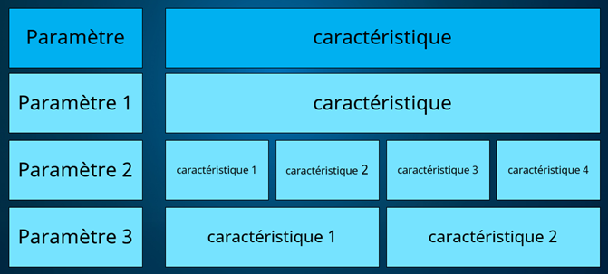
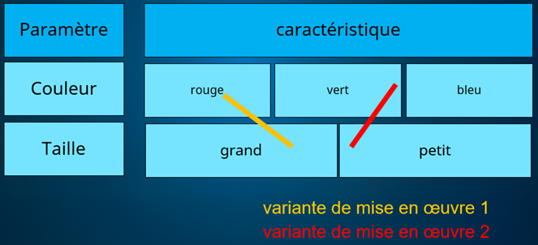
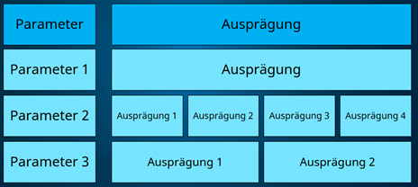
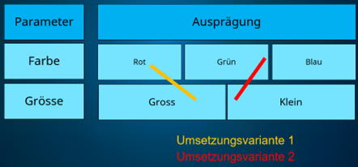

_[Deutsche Version](#d-0)_

## Introduction à la boîte morphologique

La boîte morphologique est une méthode d'analyse systématique de problématiques complexes qui peut notamment être utilisée pour la prise de décision concernant différentes variantes de mise en œuvre (cf. Zwicky 1969 [^1]). Elle a été développée par Fritz Zwicky, un astrophysicien suisse, et est aujourd'hui utilisé dans le domaine du management, les projets d'innovation et les projets publics.

Au départ, les bases de la prise de décision sont décomposées en paramètres centraux. Ces paramètres représentent des dimensions fondamentales de conception. Dans la mesure du possible, les paramètres doivent pouvoir être traités indépendamment les uns des autres.

Pour chaque paramètre, plusieurs caractéristiques possibles sont définies. Elles doivent être clairement distinguables et aussi exhaustives que possible. Les caractéristiques sont analysées à l’aide de critères d’évaluation définis, qui plaident en leur faveur ou contre elles.

La sélection d’une caractéristique pour chaque paramètre donne lieu à une variante de mise en œuvre. À l’étape suivante, plusieurs variantes de mise en œuvre sont comparées entre elles afin d’évaluer leurs avantages et leurs inconvénients.

L’ensemble des paramètres et de leurs caractéristiques respectives est représenté dans une matrice – la boîte morphologique.

  
  

L'élaboration de critères d'évaluation peut aider à présélectionner les caractéristiques appropriées et à comparer systématiquement les différentes combinaisons. Parmi les critères typiques, on peut citer par exemple la faisabilité (technique, organisationnelle, légale) ou les coûts et les ressources nécessaires.

La méthode de la boîte morphologique a été choisie afin de préparer de manière structurée et transparente le processus décisionnel complexe concernant la conception de la récolte électronique de signatures. Elle permet d’examiner non seulement les options évidentes, mais aussi les caractéristiques qui couvrent l’ensemble des solutions possibles. Les décisions sont traçables, car les paramètres sous-jacents sont clairement identifiés.

[^1]: Analyse morphologique (technique de créativité). (s. d.). Dans Wikipédia. Consulté le 27 mars 2026, à l'adresse https://de.wikipedia.org/wiki/Morphologische_Analyse_(Kreativit%C3%A4tstechnik)   

# <a name="d-0">## Einführung Morphologischer Kasten

Der morphologische Kasten ist eine Methode zur systematischen Analyse komplexer Problemstellungen und kann namentlich für die Entscheidfindung von Umsetzungsvarianten genutzt werden (vgl. Zwicky 1969[^2]). Sie wurde von Fritz Zwicky, einem Schweizer Astrophysiker, entwickelt und wird heute im Management, bei Innovationsprojekten und öffentlichen Vorhaben eingesetzt.

Zu Beginn werden die Grundlagen für die Entscheidfindung in zentrale Parameter zerlegt. Diese Parameter stellen grundlegende Gestaltungsdimensionen dar. Parameter sollten möglichst voneinander unabhängig behandelt werden können.

Für jeden Parameter werden mehrere mögliche Ausprägungen definiert. Sie sollten klar unterscheidbar und möglichst vollständig sein. Die Ausprägungen werden anhand von definierten Bewertungskriterien, die für oder gegen sie sprechen, analysiert.

Durch die Auswahl einer Ausprägung pro Parameter entsteht eine Umsetzungsvariante. Mehrere Umsetzungsvarianten werden im nächsten Schritt miteinander verglichen, um ihre Vor- und Nachteile zu bewerten.

Die Gesamtheit der Parameter und ihrer jeweiligen Ausprägungen wird in einer Matrix – dem morphologischen Kasten – dargestellt. 

  
  

Die Entwicklung von Bewertungskriterien kann dabei helfen, eine Vorselektion von geeigneten Ausprägungen zu treffen und die verschiedenen Kombinationen systematisch zu vergleichen. Typische Kriterien können beispielsweise die Umsetzbarkeit (technisch, organisatorisch, rechtlich) oder die Kosten bzw. der Ressourcenbedarf sein. 

Die Methode des morphologischen Kastens wurde gewählt, um die mehrschichtige Entscheidungsfindung mit Bezug auf die Ausgestaltung von E-Collecting strukturiert und transparent vorzubereiten. Es werden nicht nur naheliegende Optionen betrachtet, sondern auch Ausprägungen, die den gesamten möglichen Lösungsraum aufspannen. Entscheidungen sind nachvollziehbar, weil klar ist, welche Parameter zugrunde liegen. 

[^2]: Morphologische Analyse (Kreativitätstechnik). (o. D.). In Wikipedia. Abgerufen am 27. März 2026, von https://de.wikipedia.org/wiki/Morphologische_Analyse_(Kreativit%C3%A4tstechnik) 
