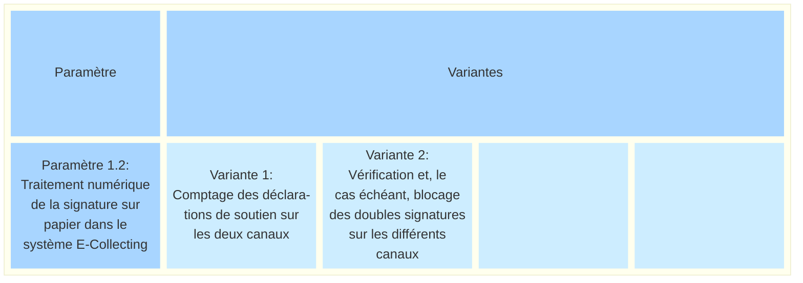
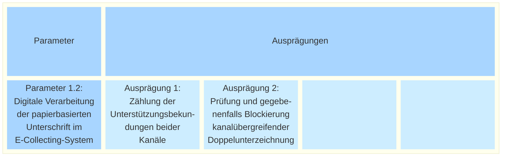

_[Deutsche Version](#d-0)_

## Boîte morphologique : Paramètre 1.2 - Traitement numérique des signatures sur papier dans le système E-Collecting

Outre la saisie des signatures sur papier par les agents municipaux dans le système de récolte électronique, la question se pose de savoir quelles données sont effectivement transmises à E-Collecting et comment elles doivent être utilisées.

Servent-elles uniquement à recenser toutes les déclarations de soutien reçues ou sont-elles utilisées pour éviter les doubles signatures sur les différents canaux ?

Dans les deux cas déjà évoqués ici, on peut partir du principe que seules les données strictement nécessaires à la finalité visée sont transmises au système de récolte électronique. Il n'est par exemple pas nécessaire de transmettre sous forme de fichier graphique une image éventuellement numérisée. Selon la mise en œuvre technique, les données transmises peuvent même être totalement anonymes.

**La discussion à ce sujet a lieu [ici](https://github.com/swiss/e-collecting/issues/13).**

Il existe des liens avec le [paramètre 1.1](parameter-1-1.md) (Le traitement numérique n'est possible que si les déclarations de soutien sur papier ont été préalablement saisies dans le système de récolte) et le [paramètre 1.3](parameter-1-3.md).

## <a name="d-0"> Morphologischer Kasten: Parameter 1.2 - Digitale Verarbeitung der papierbasierten Unterschrift im E-Collecting-System

Neben der Erfassung der papierbasierten Unterschriften durch Gemeindemitarbeiter im E-Collecting System stellt sich die Frage, welche Daten tatsächlich ans E-Collecting geschickt werden und wie sie genutzt werden sollen.

Dienen sie lediglich der Zählung aller eingegangenen Unterstützungsbekundungen oder werden sie zur Vermeidung kanalübergreifender Doppelunterzeichnungen genutzt?

Bei beiden hier bereits vorgeschlagenen Ausprägungen darf vorausgesetzt werden, dass nur diejenigen Daten ans E-Collecting-System übermittelt werden, die für den Zweck zwingend nötig sind. So ist es beispielsweise nicht nötig, ein allenfalls gescanntes Schriftbild als Grafikdatei weiterzugeben. Je nach technischer Umsetzung kann es sich bei den übermittelten Daten sogar um vollständig anonyme Daten handeln.

**Die Diskussion dazu findet [hier](https://github.com/swiss/e-collecting/issues/13) statt.** 

Es bestehen Abhängigkeiten zu [Parameter 1.1](parameter-1-1.md) (Die digitale Verarbeitung ist nur umsetzbar, wenn papierbasierte Unterstützungsbekundungen vorab im E-Collecting-System erfasst wurden) und [Parameter 1.3](parameter-1-3.md).

