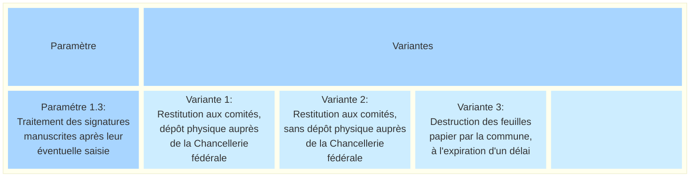
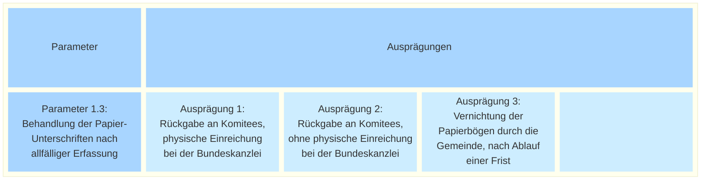

_[Deutsche Version](#d-0)_

## Boîte morphologique : Paramètre 1.3 - Traitement des signatures sur papier après leur saisie éventuelle

Si l'on part du principe que les déclarations de soutien sur papier sont saisies, au moins en partie, dans un système de récolte électronique, la question se pose ensuite de savoir comment traiter les feuilles de signatures physiques dans la suite du processus. 

Les feuilles papier peuvent être renvoyées comme auparavant aux comités, qui les remettent ensuite à la Chancellerie fédérale dans le cadre des processus existants pour le décompte. Une autre variante est également envisageable, dans laquelle les feuilles papier sont également restituées aux comités, mais sans dépôt physique ultérieur auprès de la Chancellerie fédérale, car les informations nécessaires concernant les déclarations de soutien sur papier sont consultables sous forme numérique dans le système de récolte électronique. Une autre solution consiste à laisser les feuilles papier aux communes une fois la saisie effectuée, où elles seront détruites à l’expiration d’un délai.

Les différentes options sont-elles, selon vous, présentées de manière exhaustive ? Quels avantages et inconvénients peut-on anticiper pour chacune d'entre elles ? **La discussion à ce sujet a lieu [ici](https://github.com/swiss/e-collecting/issues/14).**

Il existe des interdépendances avec le [paramètre 1.1](parameter-1-1.md) et le [paramètre 1.2.](parameter-1-2.md).

## <a name="d-0"> Morphologischer Kasten: Parameter 1.3 - Behandlung der Papier-Unterschriften nach allfälliger Erfassung

Geht man davon aus, dass papierbasierte Unterstützungsbekundungen in einem E-Collecting-System zumindest teilweise erfasst werden, stellt sich im Anschluss die Frage, wie mit den physischen Unterschriftenbögen im weiteren Prozess umzugehen ist. 

Die Papierbögen können wie bisher an die Komitees zurückgegeben werden, welche sie anschliessend im Rahmen der bestehenden Prozesse zur Auszählung bei der Bundeskanzlei einreichen. Ebenso ist eine Variante denkbar, bei der die Papierbögen ebenfalls an die Komitees zurückgegeben werden, jedoch ohne anschliessende physische Einreichung bei der Bundeskanzlei, da die notwendigen Informationen zu den papierbasierten Unterstützungsbekundungen im E-Collecting-System digital einsehbar sind. Alternativ können die Papierbögen nach erfolgter Erfassung auch bei den Gemeinden verbleiben, wo sie nach Ablauf einer Frist vernichtet werden.

Sind die Ausprägungen aus Ihrer Sicht vollständig dargestellt? Welche Vor- und Nachteile lassen sich bei der Auswahl ein jeder antizipieren? **Die Diskussion dazu findet [hier](https://github.com/swiss/e-collecting/issues/14) statt.**

Es bestehen Abhängigkeiten zu [Parameter 1.1](parameter-1-1.md) und [Parameter 1.2](parameter-1-2.md).

