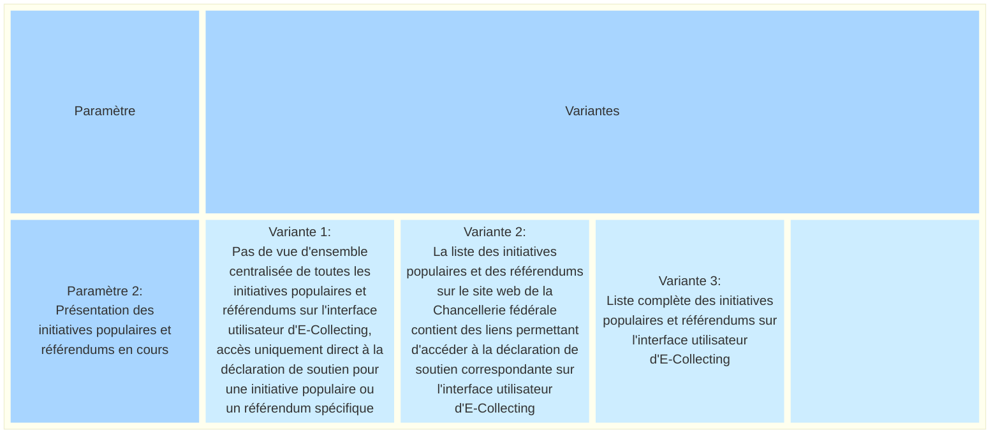
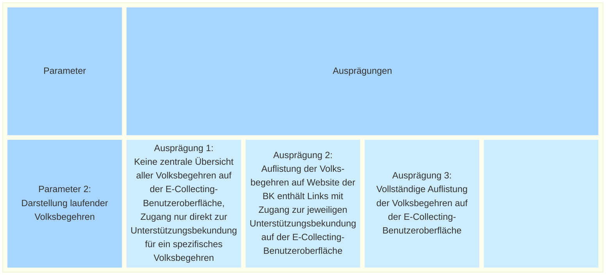

_[Deutsche Version](#d-0)_

## Boîte morphologique : Paramètre 2 - Présentation des initiatives populaires et des référendums en cours

Aujourd’hui, les initiatives populaires et les référendums en cours de récolte ou dont le délai est en cours sont publiés sous la forme de deux listes sur le site web de la Chancellerie fédérale (Au stade de la récolte des signatures; Objets pour lesquels le délai référendaire court toujours). Ce sont toutefois surtout les comités qui attirent l’attention sur leurs initiatives populaires et leurs référendums pendant la récolte des déclarations de soutien.

Dans le contexte d’un système de récolte électronique, on peut envisager différentes formes de présentation des initiatives populaires et des référendums : d’une solution sans aperçu centralisé, dans laquelle l’accès se fait exclusivement par des liens directs vers les différentes récoltes de signatures, en passant par des modèles avec un lien vers les récoltes de signatures sur le site web de la Chancellerie fédérale (le cas échéant avec une présentation différenciée des initiatives et des référendums), jusqu’à une liste complète de toutes les initiatives populaires et référendums dont la période de collecte est en cours, qui sont directement soumis aux électeurs sur l’interface utilisateur de l’E-Collecting afin qu’ils les soutiennent. 

Les différentes options possibles pour ce paramètre sont-elles, selon vous, présentées de manière exhaustive ? Quelles seraient les conséquences possibles du choix de l'une de ces options ? **La discussion à ce sujet a lieu [ici](https://github.com/swiss/e-collecting/issues/15).**

Cette question a déjà été abordée dans le cadre du dialogue participatif.
*	[Résumé des arguments](https://github.com/swiss/e-collecting/blob/main/docs/summaries/first-summary-online-dialogue.md#discussion-3--pr%C3%A9sentation-des-r%C3%A9coltes-en-cours-)  
*	[Discussion](https://github.com/swiss/e-collecting/issues/3)  

## <a name="d-0"> Morphologischer Kasten: Parameter 2 - Darstellung laufender Volksbegehren

Heute werden die Volksinitiativen und Referenden im Sammelstadium bzw. mit laufender Frist in Form von zwei Listen auf der Website der Bundeskanzlei publiziert ([Hängige Volksinitiativen](https://www.bk.admin.ch/ch/d/pore/vi/vis_1_3_1_1.html), [Vorlagen mit laufender Referendumsfrist](https://www.bk.admin.ch/ch/d/pore/rf/ref_1_3_2_1.html)). Es sind aber vor allem die Komitees, die während der Mobilisierung von Unterstützungsbekundungen auf ihre Volksbegehren aufmerksam machen.

Im Kontext eines E-Collecting-Systems lassen sich unterschiedliche mögliche Ausprägungen für die Darstellung von Volksbegehren ableiten: von einer Lösung ohne zentrale Übersicht, bei welcher der Zugang ausschliesslich über direkte Links zu den einzelnen Unterschriftensammlungen erfolgt, über Modelle mit einer Verlinkung der Unterschriftensammlungen auf der Website der Bundeskanzlei (gegebenenfalls mit differenzierter Darstellung von Initiativen und Referenden), bis hin zu einer vollständigen Liste aller Volksbegehren mit laufender Sammelfrist, die den Stimmberechtigten auf der E-Collecting-Benutzeroberfläche direkt zur Unterstützung unterbreitet werden. 

Sind die möglichen Ausprägungen dieses Parameters aus Ihrer Sicht vollständig dargestellt? Welche möglichen Auswirkungen hätte die Auswahl einer der möglichen Ausprägungen? **Die Diskussion dazu findet [hier](https://github.com/swiss/e-collecting/issues/15) statt.**

Diese Frage wurde im partizipativen Dialog bereits erörtert.
* [Zusammenfassung der Argumente](https://github.com/swiss/e-collecting/blob/main/docs/summaries/first-summary-online-dialogue.md#diskussion-3-darstellung-laufender-sammlungen)
* [Diskussion](https://github.com/swiss/e-collecting/issues/3)

