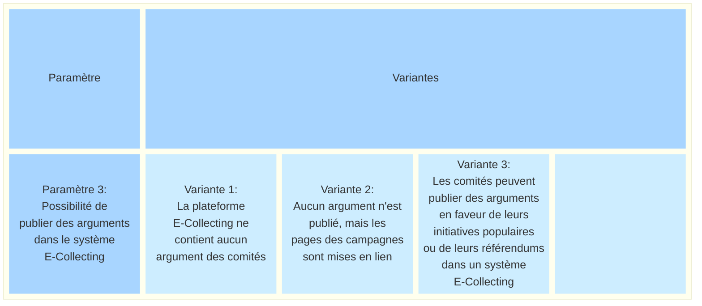
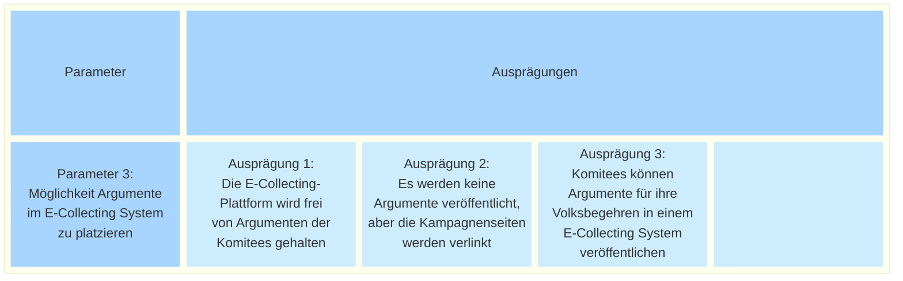

_[Deutsche Version](#d-0)_

## Boîte morphologique : Paramètre 3 - Possibilité de publier des arguments dans le système de récolte électronique de signatures

Les formulaires papier peuvent contenir des arguments en faveur d’une initiative populaire ou d’un référendum, à condition de ne pas dépasser les limites des prescriptions formelles. Cela garantit que les électeurs remettent leurs déclarations de soutien en connaissance des informations qui les concernent. Avec l’introduction d’un système E-Collecting, la question se pose de savoir si et sous quelle forme des possibilités comparables d’information et d’argumentation doivent également être prévues au format numérique.

On peut distinguer différentes variantes : d’une plateforme strictement neutre, sans arguments ni contenus supplémentaires, à des configurations de plateforme sans contenu propre, mais avec des liens vers les sites de campagne externes des comités, jusqu’à une solution avec insertion directe d’arguments dans le système de récolte électronique. Si l’on opte pour la possibilité d’insérer des arguments, il faudrait, dans une prochaine étape, clarifier les exigences formelles. 

Les différentes variantes possibles de ce paramètre sont-elles, selon vous, présentées de manière exhaustive ? Quels sont les avantages et les inconvénients de chacune de ces variantes ? **La discussion à ce sujet a lieu [ici](https://github.com/swiss/e-collecting/issues/16).**

## <a name="d-0"> Morphologischer Kasten: Parameter 3 - Möglichkeit, Argumente im E-Collecting System zu platzieren

Die Papierbögen dürfen Argumente für die Unterstützung eines Volksbegehrens enthalten, wobei die Grenzen der Formvorschriften nicht überschritten werden dürfen. Dadurch ist sichergestellt, dass die Stimmberechtigten ihre Unterstützungsbekundung in Kenntnis der für sie relevanten Informationen abgeben. Mit der Einführung eines E-Collecting-Systems stellt sich die Frage, ob und in welcher Form vergleichbare Möglichkeiten der inhaltlichen Information und Argumentation auch digital vorgesehen werden sollen.

Dabei lassen sich unterschiedliche Ausprägungen unterscheiden: von einer strikt neutralen Plattform ohne Argumente oder zusätzliche Inhalte, über Plattform-Ausgestaltungen ohne eigene Inhalte, jedoch mit Verlinkungen auf externe Kampagnenseiten der Komitees, bis hin zu einer Lösung mit direkter Platzierung von Argumenten im E-Collecting-System. Sollte man sich für die Möglichkeit entscheiden, Argumente zu platzieren, müssten in einem nächsten Schritt die Formanforderungen geklärt werden. 

Sind die möglichen Ausprägungen dieses Parameters aus Ihrer Sicht vollständig dargestellt? Welche Vor- und Nachteile ergeben sich aus den einzelnen Ausprägungen? **Die Diskussion dazu findet [hier](https://github.com/swiss/e-collecting/issues/16) statt.**

