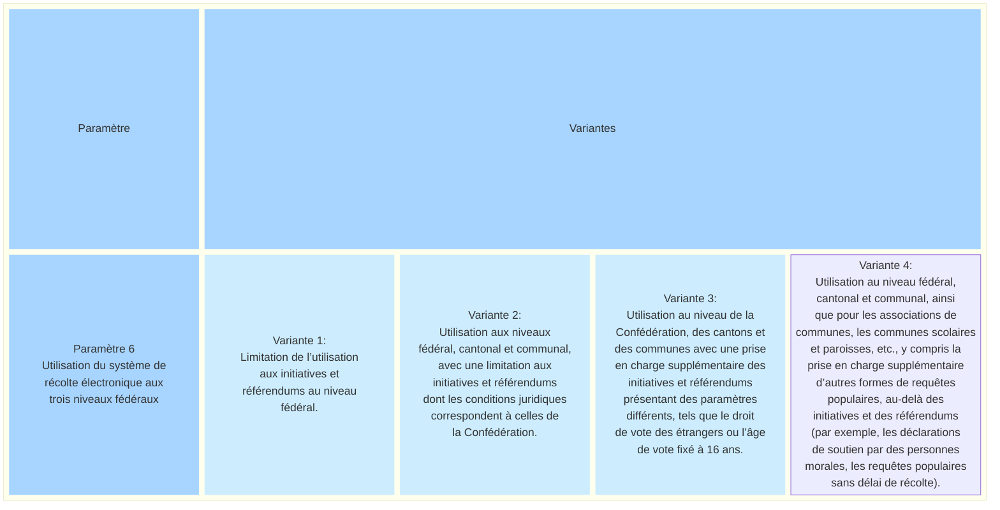
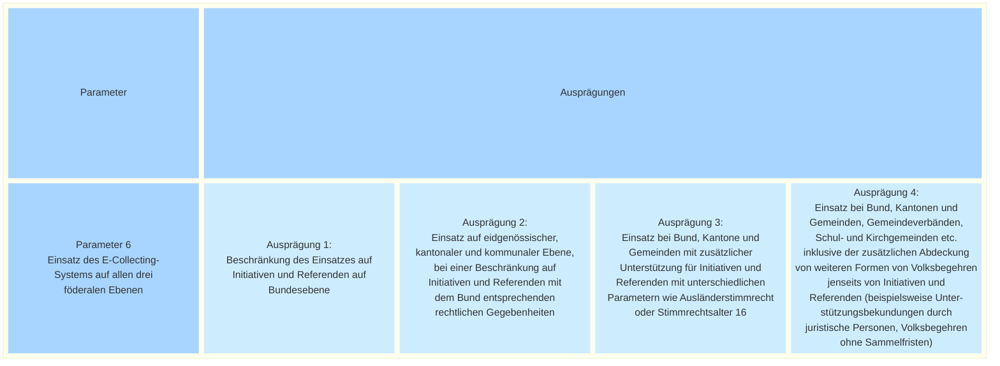

_[Deutsche Version](#d-0)_

## Boîte morphologique : Paramètre 6 - Utilisation du système de récolte électronique aux trois niveaux fédéraux

La question se pose de savoir si les essais doivent se limiter au niveau fédéral ou s’il serait plus judicieux d’inclure dès le départ les requêtes populaires cantonales et communales dans les essais.

Si l'on pousse la réflexion jusqu'au bout, un système de récolte électronique pourrait donc couvrir, outre la Confédération, les besoins des cantons, des communes ainsi que d'autres collectivités telles que les associations de communes, les communes scolaires et les paroisses.

Une clarification de la Chancellerie fédérale a montré que des conditions juridiques en partie différentes s'appliquent aux niveaux cantonal et communal (droit de vote des étrangers, âge de vote fixé à 16 ans). Il existe en outre des formes alternatives de requêtes populaires qui sont inconnues au niveau fédéral (p. ex. initiatives législatives, déclarations de soutien par des personnes morales). Ces différences doivent être prises en compte lors de la planification d’un système, ce qui implique des efforts supplémentaires.

L’utilisation du système de récolte électronique à plusieurs niveaux fédéraux entraîne donc une augmentation de la complexité et des coûts. 

Les différentes valeurs possibles de ce paramètre sont-elles, selon vous, toutes présentées ? Quelles seraient les conséquences possibles du choix de l'une de ces valeurs ? **La discussion à ce sujet a lieu [ici](https://github.com/swiss/e-collecting/issues/19).**

## <a name="d-0"> Morphologischer Kasten: Parameter 6 - Einsatz des E-Collecting-Systems auf allen drei föderalen Ebenen

Es stellt sich die Frage, ob die Versuche sich auf die Bundesebene beschränken sollen oder ob es sinnvoller wäre, von Anfang an auch kantonale und kommunale Volksbegehren in die Versuche einzubeziehen. 

Konsequent zu Ende gedacht könnte ein E-Collecting-System also neben dem Bund auch die Bedürfnisse von Kantonen, Gemeinden sowie weiteren Körperschaften wie Gemeindeverbänden, Schul- und Kirchgemeinden abdecken.

Eine Abklärung der Bundeskanzlei hat ergeben, dass auf Kantons- und Gemeindestufe zum Teil andere rechtliche Gegebenheiten gelten (Ausländerstimmrecht, Stimmrechtsalter 16). Darüber hinaus existieren alternative Formen von Volksbegehren, die auf Bundesebene unbekannt sind (z.B. Gesetzesinitiativen, Unterstützungsbekundungen durch juristische Personen, Volksbegehren ohne Sammelfristen). Diese Unterschiede müssen bei der Planung eines Systems mitgedacht werden, was zusätzliche Aufwände bedeutet.

Die Nutzung des E-Collecting-Systems auf mehreren föderalen Ebenen führt also zu einer Erhöhung der Komplexität und der Kosten.

Sind die möglichen Ausprägungen dieses Parameters aus Ihrer Sicht vollständig dargestellt? Welche möglichen Auswirkungen hätte die Auswahl einer der möglichen Ausprägungen? **Die Diskussion dazu findet [hier](https://github.com/swiss/e-collecting/issues/19) statt.**

