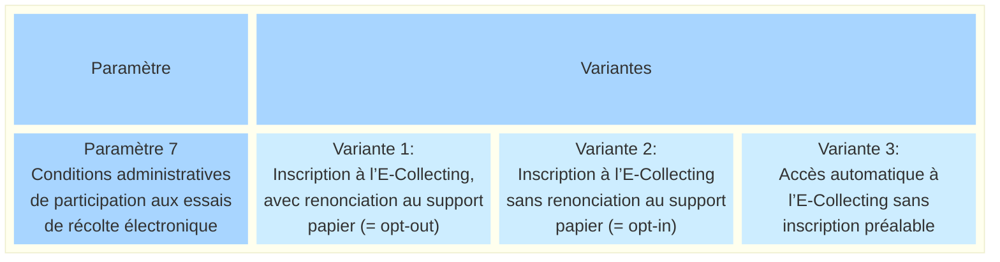
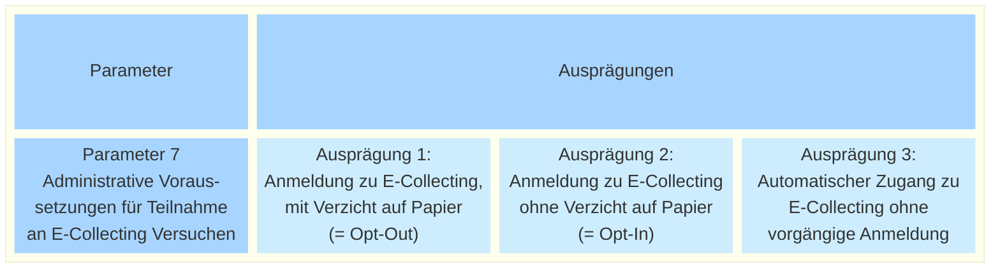

_[Deutsche Version](#d-0)_

## Boîte morphologique : Paramètre 7 - Conditions administratives de participation aux essais de récolte électronique

Si l'on veut empêcher qu'un électeur apporte son soutien à la fois sur papier et par voie numérique (= double signature), cela entraîne une charge technique supplémentaire.

On pourrait éviter cette charge en obligeant tous les électeurs à choisir entre le papier et l’E-Collecting (= opt-out). Cela entraîne toutefois des problèmes administratifs et juridiques. Ces difficultés ont déjà été abordées dans le cadre du dialogue écrit.

* [Lien Discussion](https://github.com/swiss/e-collecting/issues/2)
* [Lien Résumé de la discussion](https://github.com/swiss/e-collecting/blob/main/docs/summaries/first-summary-online-dialogue.md#discussion-2--est-il-vraiment-possible-d%C3%A9viter-de-se-retirer-du-processus-papier-)

Ce paramètre est néanmoins soumis à nouveau formellement à la discussion.

Indépendamment de la question discutée ici, le législateur définit, dans le projet de révision partielle de la loi fédérale sur les droits politiques, d’autres restrictions telles qu’une limitation proportionnelle des déclarations de soutien numériques. Cela ne fait toutefois pas partie du paramètre traité ici. Il s’agit ici exclusivement des conditions de participation pour chaque électeur.

Les différentes valeurs possibles de ce paramètre sont-elles, selon vous, toutes présentées ? Quelles seraient les conséquences possibles du choix de l'une de ces valeurs ? **La discussion à ce sujet a lieu [ici](https://github.com/swiss/e-collecting/issues/20).**

## <a name="d-0"> Morphologischer Kasten: Parameter 7 - Administrative Voraussetzungen für Teilnahme an E-Collecting Versuchen

Wenn man verhindern will, dass eine stimmberechtigte Person ihre Unterstützung auf Papier und gleichzeitig auf dem digitalen Kanal leistet (= Doppelunterschrift), führt dies zu technischem Mehraufwand.

Man könnte diesen Aufwand vermeiden, indem man sämtliche Stimmberechtigten dazu zwingt, sich zwischen Papier und E-Collecting zu entscheiden (= Opt-Out). Dies führt allerdings zu administrativen und rechtlichen Problemen. Diese Schwierigkeiten wurden im schriftlichen Dialog bereits diskutiert.

* [Link Diskussion](https://github.com/swiss/e-collecting/issues/2)
* [Link Zusammenfassung der Diskussion](https://github.com/swiss/e-collecting/blob/main/docs/summaries/first-summary-online-dialogue.md#diskussion-2-l%C3%A4sst-sich-ein-opt-out-f%C3%BCr-den-papierprozess-wirklich-vermeiden)

Dennoch wird der Parameter noch einmal formell zur Diskussion gestellt.

Unabhängig von der hier diskutierten Frage definiert der Gesetzgeber im Entwurf für die Teilrevision des Bundesgesetzes über die politischen Rechte weitere Einschränkungen wie etwa eine anteilsmässige Beschränkung der digitalen Unterstützungsbekundungen. Dies ist aber nicht Teil des hier behandelten Parameters. Hier geht es ausschliesslich um die Teilnahme-Voraussetzungen für die einzelnen Stimmberechtigten.

Sind die möglichen Ausprägungen dieses Parameters aus Ihrer Sicht vollständig dargestellt? Welche möglichen Auswirkungen hätte die Auswahl einer der möglichen Ausprägungen? **Die Diskussion dazu findet [hier](https://github.com/swiss/e-collecting/issues/20) statt.**

