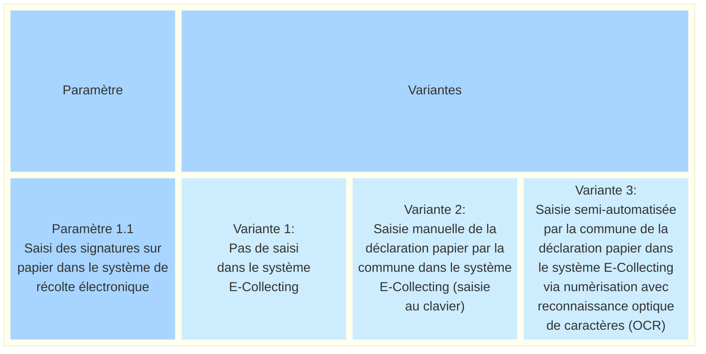
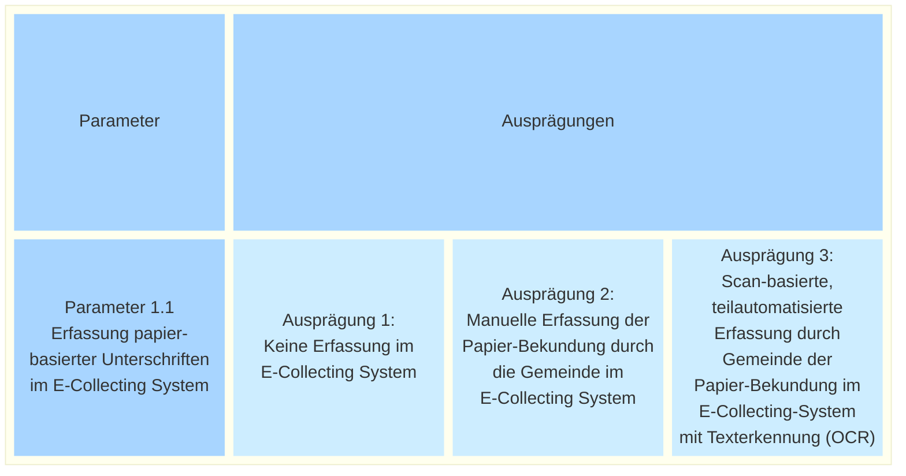

_[Deutsche Version](#d-0)_

## Boîte morphologique : Paramètre 1.1 - Saisie des signatures sur papier dans le système E-Collecting

Si, à l’avenir, une partie des signatures pour les initiatives populaires fédérales et les référendums au niveau fédéral, est déposée par voie électronique, la question se pose de savoir comment intégrer les canaux numériques et papier pour la vérification et le dépouillement des signatures, notamment afin d’éviter les doubles signatures. L'intégration des signatures sur papier dans un système de récolte électronique peut se faire à différents niveaux, allant d'une séparation complète des canaux à une saisie numérique des déclarations de soutien reçues par la commune. 

Si l’on renonce à la mise à disposition numérique des déclarations de soutien d’origine papier pour le dépouillement, il faut tout de même vérifier si la personne qui a apporté sa déclaration de soutien sur papier a déjà apporté une déclaration de soutien numérique via le système de récolte électronique.

Selon la configuration, la saisie numérique des déclarations de soutien sur papier peut couvrir différents niveaux de détail des données – allant d’une représentation minimale dans le système en passant par la reprise complète de toutes les informations. L’étendue concrète de la saisie des données n’est pas encore représentée en tant que paramètre, car elle dépend fortement de l’intégration choisie entre le canal papier et le canal numérique.   

Les valeurs possibles de ce paramètre sont-elles, selon vous, présentées de manière exhaustive ? Quels sont les avantages et les inconvénients de chacune de ces valeurs ? **La discussion à ce sujet a lieu [ici](https://github.com/swiss/e-collecting/issues/12).**

## <a name="d-0"> Morphologischer Kasten: Parameter 1.1 - Erfassung papierbasierter Unterschriften im E-Collecting-System durch die Gemeinde

Wird in Zukunft ein Teil der Unterschriften für Volksbegehren auf elektronischem Wege abgegeben, stellt sich die Frage, wie der digitale und der papierbasierte Kanal für die Überprüfung und Auszählung von Unterschriften miteinander integriert werden, namentlich um Doppelunterschriften zu verhindern. Die Integration papierbasierter Unterschriften in ein E-Collecting-System kann in unterschiedlichem Ausmass erfolgen - von einer vollständigen Trennung der Kanäle bis hin zu einer digitalen Erfassung der bei der Gemeinde eingegangenen Unterstützungsbekundungen. 

Verzichtet man auf die digitale Bereitstellung von Unterstützungsbekundungen papiernen Ursprungs für die Auszählung, muss dennoch überprüft werden, ob die Person, welche die Unterstützungsbekundung auf Papier geleistet hat, bereits eine digitale Unterstützungsbekundung via E-Collecting abgegeben hat.

Je nach Ausgestaltung kann die digitale Erfassung papierbasierter Unterstützungsbekundungen unterschiedliche Datentiefen umfassen - von einer minimalen systemseitigen Repräsentation bis zur vollständigen Übernahme aller Angaben. Der konkrete Umfang der Datenerfassung wird noch nicht als Parameter abgebildet, da er stark von der gewählten Integration des papierbasierten und digitalen Kanals abhängt.  

Sind die möglichen Ausprägungen dieses Parameters aus Ihrer Sicht vollständig dargestellt? Welche Vor- und Nachteile ergeben sich aus den einzelnen Ausprägungen? **Die Diskussion dazu findet [hier](https://github.com/swiss/e-collecting/issues/12) statt.**

Es bestehen Abhängigkeiten zu [Parameter 1.2](parameter-1-2.md) und [Parameter 1.3](parameter-1-3.md).

