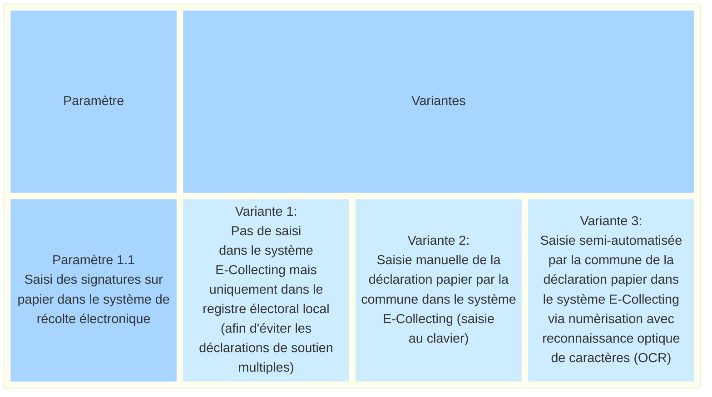
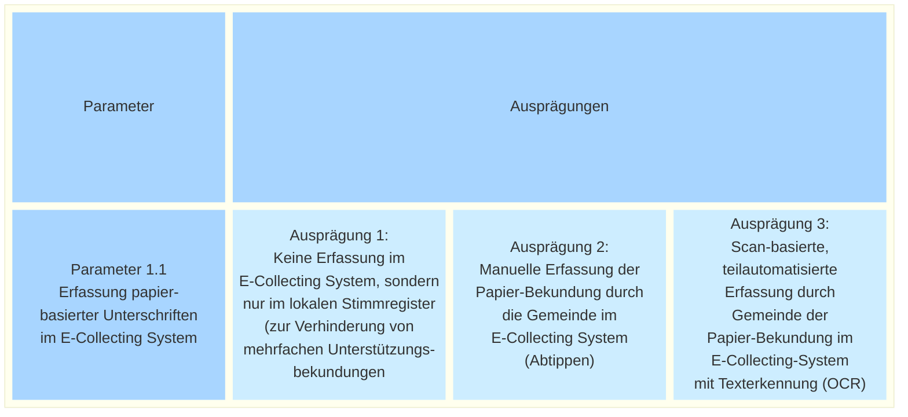

_[Deutsche Version](#d-0)_

## Boîte morphologique : Paramètre 1.1 - Saisie des signatures sur papier dans le système E-Collecting

Si, à l'avenir, une partie des signatures pour les initiatives populaires est recueillie par voie électronique, la question se pose de savoir comment intégrer les canaux numérique et papier pour la vérification et le dépouillement des signatures, notamment afin d'éviter les doubles signatures. La saisie des signatures sur papier dans un système de collecte électronique peut s'effectuer à différents niveaux : cela va de la non-saisie dans le système de collecte électronique à la saisie manuelle, en passant par la saisie semi-automatisée des déclarations de soutien reçues par la commune. Nous partons ici du principe qu’une éventuelle saisie dans le système de récolte électroique s’effectue via le logiciel communal ou le registre électoral de la commune.

Par « enregistrement », nous entendons la saisie et la conservation de la déclaration de soutien.

Même si l'on renonce à saisir les déclarations de soutien sur papier dans le système E-Collecting (option 1 : « Pas de saisie dans le système E-Collecting »), il faut tout de même vérifier si la personne dont la déclaration de soutien est disponible sur papier a déjà effectué une déclaration de soutien numérique via E-Collecting. Pour ce faire, il suffit d’interroger le système E-Collecting (via le logiciel communal).

Les valeurs possibles de ce paramètre sont-elles, selon vous, présentées de manière exhaustive ? Quels sont les avantages et les inconvénients de chacune de ces valeurs ? **La discussion à ce sujet a lieu [ici](https://github.com/swiss/e-collecting/issues/12).**

Il existe des dépendances avec [Paramètre 1.2](parameter-1-2.md) et [Paramètre 1.3](parameter-1-3.md).

## <a name="d-0"> Morphologischer Kasten: Parameter 1.1 - Erfassung papierbasierter Unterschriften im E-Collecting-System durch die Gemeinde

Wird in Zukunft ein Teil der Unterschriften für Volksbegehren auf elektronischem Wege abgegeben, stellt sich die Frage, wie der digitale und der papierbasierte Kanal für die Überprüfung und Auszählung von Unterschriften miteinander integriert werden, namentlich um Doppelunterschriften zu verhindern. Die Erfassung papierbasierter Unterschriften in ein E-Collecting-System kann in unterschiedlichem Ausmass erfolgen - von einem Verzicht auf Erfassung im E-Collecting-System, zu einer manuellen bis hin zu einer teilautomatisierten Erfassung der bei der Gemeinde eingegangenen Unterstützungsbekundungen. Hier gehen wir davon aus, dass eine allfällige Erfassung im E-Collecting-System via die Gemeindesoftware respektive das Stimmregister der Gemeinde erfolgt.

Mit der Erfassung meinen wir das Aufnehmen und Festhalten der Unterstützungsbekundung.

Auch wenn man auf die Erfassung von Unterstützungsbekundungen papiernen Ursprungs im E-Collecting-System (Ausprägung 1: «Keine Erfassung im E-Collecting-System») verzichtet, muss doch noch überprüft werden, ob die Person, deren Unterstützungsbekundung auf Papier vorliegt, bereits eine digitale Unterstützungsbekundung via E-Collecting geleistet hat. Dies kann erreicht werden, indem das E-Collecting-System (via Gemeindesoftware) abgefragt wird.

Auch in dieser Ausprägung bleibt allerdings die Notwendigkeit bestehen, im Stimmregister zu prüfen, ob zu einem früheren Zeitpunkt bereits eine Unterstützungsbekundung auf Papier eingegangen ist. Dies entspricht dem bestehenden Papierprozess.

Je nach Ausgestaltung kann die digitale Erfassung papierbasierter Unterstützungsbekundungen unterschiedliche Datentiefen umfassen - von einer blossen Registrierung des Eingangs (damit das E-Collecting-System nachfolgende Unterstützungsbekundungen als mehrfache Unterstützungsbekundungen abweisen kann) bis zur vollständigen Übernahme, so dass eine auf Papier eingegangenen Unterstützungsbekundung digital ausgezählt werden kann. Die Frage der Übermittlung der Daten an das E-Collecting wird erst in Parameter 1.2 behandelt.

Sind die möglichen Ausprägungen dieses Parameters aus Ihrer Sicht vollständig dargestellt? Welche Vor- und Nachteile ergeben sich aus den einzelnen Ausprägungen? **Die Diskussion dazu findet [hier](https://github.com/swiss/e-collecting/issues/12) statt.**

Es bestehen Abhängigkeiten zu [Parameter 1.2](parameter-1-2.md) und [Parameter 1.3](parameter-1-3.md).

