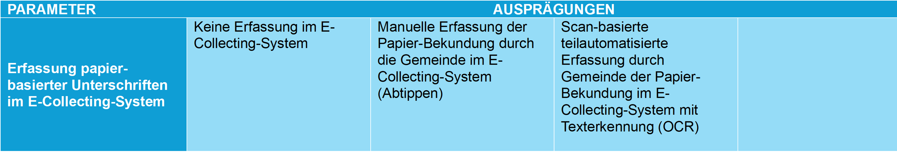

## Parameter 1.1: Erfassung papierbasierter Unterschriften im E-Collecting-System durch die Gemeinde

Wird in Zukunft ein Teil der Unterschriften für Volksbegehren auf elektronischem Wege abgegeben, stellt sich die Frage, wie der digitale und der papierbasierte Kanal für die Überprüfung und Auszählung von Unterschriften miteinander integriert werden, namentlich um Doppelunterschriften zu verhindern. Die Integration papierbasierter Unterschriften in ein E-Collecting-System kann in unterschiedlichem Ausmass erfolgen - von einer vollständigen Trennung der Kanäle bis hin zu einer digitalen Erfassung der bei der Gemeinde eingegangenen Unterstützungsbekundungen. 

Verzichtet man auf die digitale Bereitstellung von Unterstützungsbekundungen papiernen Ursprungs für die Auszählung, dann muss doch noch überprüft werden, ob die Person, welche die Unterstützungsbekundung auf Papier geleistet hat, bereits eine digitale Unterstützungsbekundung via E-Collecting geleistet hat.

Je nach Ausgestaltung kann die digitale Erfassung papierbasierter Unterstützungsbekundungen unterschiedliche Datentiefen umfassen - von einer blossen Registrierung des Eingangs über eine minimale systemseitige Repräsentation bis zur vollständigen Übernahme aller Angaben. Der konkrete Umfang der Datenerfassung wird noch nicht als Parameter abgebildet, da er stark von der gewählten Integration des papierbasierten und digitalen Kanals abhängt.  

Sind die möglichen Ausprägungen dieses Parameters aus Ihrer Sicht vollständig dargestellt? Welche Vor- und Nachteile ergeben sich aus den einzelnen Ausprägungen?

