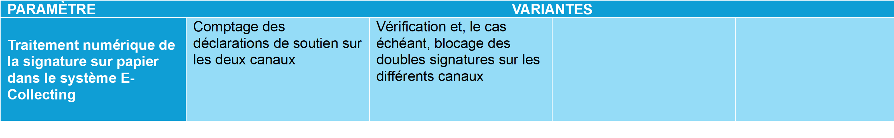
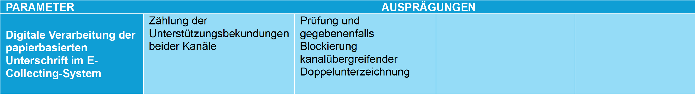

_[Deutsche Version](#d-0)_

## Boîte morphologique : Paramètre 1.2 - Traitement numérique des signatures sur papier dans le système E-Collecting

Outre la saisie des signatures sur papier par les employés de la commune dans le système de récolte électronique, la question se pose de savoir comment les données ainsi extraites doivent être utilisées. Servent-elles uniquement à compter toutes les déclarations de soutien reçues ou sont-elles utilisées pour éviter les doubles signatures sur différents canaux ?   

Il existe des liens avec le [paramètre 1.1](parameter-1-1.md) et le [paramètre 1.3](parameter-1-3.md).

 

## <a name="d-0"> Morphologischer Kasten: Parameter 1.2 - Digitale Verarbeitung der papierbasierten Unterschrift im E-Collecting-System

Neben der Erfassung der papierbasierten Unterschriften durch Gemeindemitarbeiter im E-Collecting System stellt sich die Frage, wie die daraus entnommenen Daten genutzt werden sollen. 

Dienen sie lediglich der Zählung aller eingegangenen Unterstützungsbekundungen oder werden sie zur Vermeidung kanalübergreifender Doppelunterzeichnungen genutzt? Die Diskussion dazu findet [hier](https://github.com/swiss/e-collecting/issues/13) statt. 

Es bestehen Abhängigkeiten zu [Parameter 1.1](parameter-1-1.md) und [Parameter 1.3](parameter-1-3.md).

