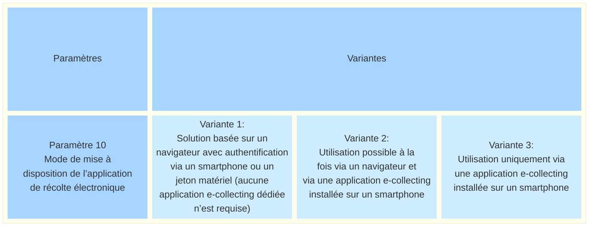
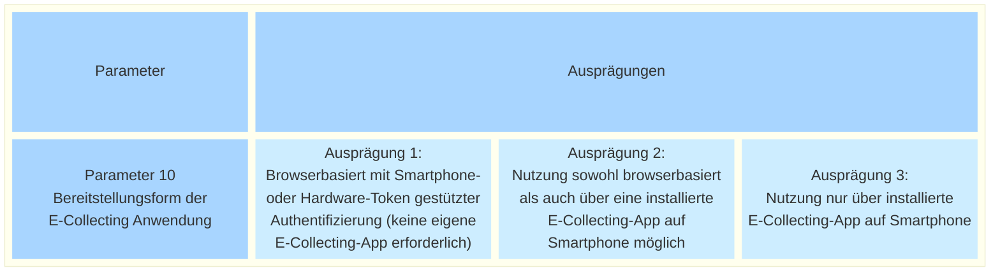

_[Deutsche Version](#d-0)_

## Boîte morphologique : Paramètre 10 - Mode de mise à disposition de l’application de récolte électronique

Un système de récolte électronique peut être mis à la disposition des électeurs sous différentes formes. Son utilisation peut se faire exclusivement via un navigateur avec une authentification par smartphone ou par jeton matériel, être possible à la fois via un navigateur et via une application installée sur smartphone, ou reposer entièrement sur une application installée sur smartphone.

La forme de mise à disposition influence notamment l’accessibilité, le déroulement de la déclaration de soutien, la facilité d’utilisation ainsi que les exigences en matière de développement, d’exploitation et de maintenance du système.

Les variantes possibles de ce paramètre sont-elles, selon vous, présentées de manière exhaustive ? Quels sont les avantages et les inconvénients de chacune de ces variantes ? La discussion à ce sujet a lieu ici.

Il existe des interdépendances avec le paramètre 11.

## <a name="d-0"> Morphologischer Kasten: Parameter 10 - Bereitstellungsform der E-Collecting Anwendung

Ein E-Collecting-System kann den Stimmberechtigten in verschiedenen Formen bereitgestellt werden. Die Nutzung kann ausschliesslich browserbasiert mit einer Smartphone- oder Hardware-Token-gestützten Authentifizierung erfolgen, sowohl browserbasiert als auch über eine installierte Smartphone-App möglich sein oder vollständig auf einer installierten Smartphone-App basieren.

Die Bereitstellungsform beeinflusst unter anderem die Zugänglichkeit, den Ablauf der Unterstützungsbekundung, die Benutzerfreundlichkeit sowie die Anforderungen an Entwicklung, Betrieb und Wartung des Systems.

Sind die möglichen Ausprägungen dieses Parameters aus Ihrer Sicht vollständig dargestellt? Welche Vor- und Nachteile ergeben sich aus den einzelnen Ausprägungen? Die Dieskussion dazu finder hier statt.

Es bestehen Abhängigkeiten zu Parameter 11.

