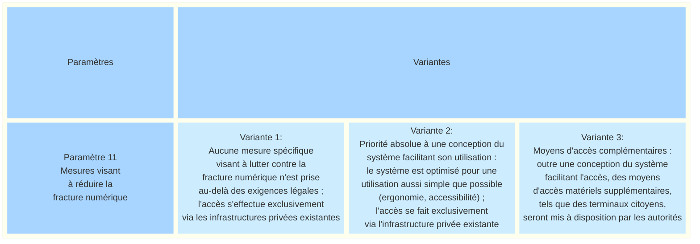
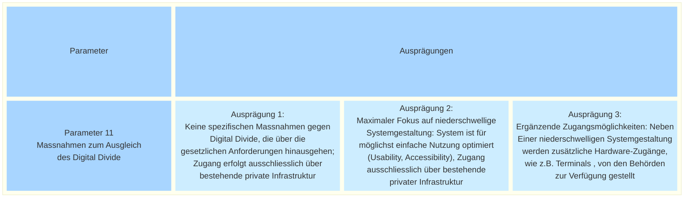

_[Deutsche Version](#d-0)_

## Boîte morphologique : Paramètre 11 - Mesures visant à réduire la fracture numérique

Comment garantir que le plus grand nombre possible d’électeurs puisse utiliser un système d’e-collecting, indépendamment des appareils auxquels ils ont accès ou de leurs compétences et aptitudes numériques ?

La conception des essais d’e-collecting peut prévoir différentes mesures visant à lever les obstacles numériques et à faciliter l’accès au plus grand nombre de personnes possible. À cet égard, tant la conception du système lui-même, qui doit être aussi accessible que possible, que les possibilités d’accès disponibles – par exemple les appareils privés ou les bornes publiques – peuvent jouer un rôle.

Les offres numériques de la Confédération sont déjà soumises à des exigences contraignantes en matière d’accessibilité numérique. Celles-ci visent à garantir que les applications numériques puissent, dans la mesure du possible, être utilisées également par des personnes en situation de handicap ou ayant des besoins particuliers en matière de soutien. Les modèles présentés ci-après se distinguent par la question de savoir si, et dans quelle mesure, des mesures supplémentaires allant au-delà de ces exigences minimales sont prévues pour réduire les obstacles à l’accès numérique.

L’on pourrait également envisager la mise à disposition d’accès matériels publics afin de permettre aux personnes ayant le droit de vote qui ne disposent pas d’appareils adaptés de participer à la récolte électronique des signatures. Des approches comparables sont mises en œuvre de manière ponctuelle dans la practique. Dans le Land allemand de Hesse, des communes pilotes utilisent ce qu’on appelle des « terminaux citoyens », qui permettent l’accès aux services administratifs numériques. Au Portugal, l’Union européenne soutient les « citizen spots », des points d’accueil physiques dans les communes où les citoyens peuvent utiliser les services administratifs numériques sur des bornes en libre-service – seuls ou avec l’aide du personnel communal sur place.

L’éventail de ce paramètre s’étend donc d’une approche ne prévoyant aucune mesure supplémentaire au-delà des exigences légales, en passant par une conception du système particulièrement conviviale et accessible, jusqu’à la mise à disposition de possibilités d’accès publiques supplémentaires, par exemple sous la forme de bornes mises à disposition par les autorités.

Les variantes possibles de ce paramètre sont-elles, selon vous, présentées de manière exhaustive ? Quels sont les avantages et les inconvénients de chacune de ces variantes ? **La discussion à ce sujet a lieu [ici](https://github.com/swiss/e-collecting/issues/26).** 

Il existe des interdépendances avec le paramètre 10.

## <a name="d-0"> Morphologischer Kasten: Parameter 11 - Massnahmen zum Ausgleich des Digital Divide

Wie kann sichergestellt werden, dass möglichst viele Stimmberechtigte ein E-Collecting-System nutzen können, unabhängig von den Geräten, auf die sie Zugriff haben, oder ihren digitalen Kompetenzen und Fähigkeiten?

Die Ausgestaltung der E-Collecting-Versuche kann unterschiedliche Massnahmen vorsehen, um digitale Hürden abzubauen und den Zugang für möglichst viele Personen zu erleichtern. Dabei können sowohl die möglichst barrierefreie Gestaltung des Systems selbst als auch die verfügbaren Zugangsmöglichkeiten - zum Beispiel private Geräte oder öffentliche Terminals - eine Rolle spielen.

Für digitale Angebote des Bundes gelten bereits verbindliche Anforderungen an die digitale Barrierefreiheit (WCAG 2.1 Level AA und eCH-0059 Accessibility Standard V3.0).  Diese sollen sicherstellen, dass digitale Anwendungen möglichst auch von Menschen mit Behinderungen oder besonderen Unterstützungsbedürfnissen genutzt werden können. Die nachfolgenden Ausprägungen unterscheiden sich darin, ob und in welchem Umfang über diese Mindestanforderungen hinaus zusätzliche Massnahmen zur Verringerung digitaler Zugangshürden vorgesehen werden.

Denkbar wäre auch die Bereitstellung öffentlicher Hardware-Zugänge, um stimmberechtigten Personen, die nicht über geeignete Endgeräte verfügen, die Teilhabe an E-Collecting zu ermöglichen. Vergleichbare Ansätze werden vereinzelt in der Praxis verfolgt. Im deutschen Bundesland Hessen setzen Pilotkommunen sogenannte Bürgerterminals ein, die den Zugang zu digitalen Verwaltungsdiensten ermöglichen. In Portugal unterstützt die Europäische Union sogenannte «citizen spots», physische Anlaufstellen in Gemeinden, an denen Bürgerinnen und Bürger digitale Verwaltungsdienste an Self-Service-Terminals - allein  oder mit Unterstützung durch Gemeindemitarbeiter vor Ort - nutzen können.

Das Spektrum des Parameters reicht also von einem Ansatz, der keine zusätzlichen Massnahmen über die gesetzlichen Anforderungen hinaus vorsieht, über eine besonders benutzerfreundliche und barrierefreie  Systemgestaltung bis hin zur Bereitstellung zusätzlicher öffentlicher Zugangsmöglichkeiten, beispielsweise in Form von Terminals, die von den Behörden zur Verfügung gestellt werden.

Sind die möglichen Ausprägungen dieses Parameters aus Ihrer Sicht vollständig dargestellt? Welche Vor- und Nachteile ergeben sich aus den einzelnen Ausprägungen? **Die Diskussion dazu findet [hier](https://github.com/swiss/e-collecting/issues/26) statt.** 

Es bestehen Abhängigkeiten zu Parameter 10. 

