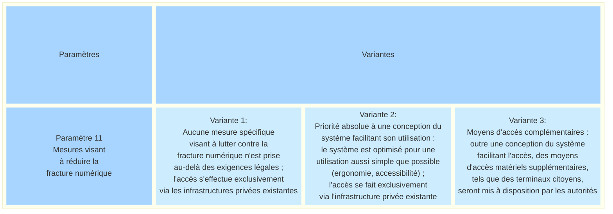
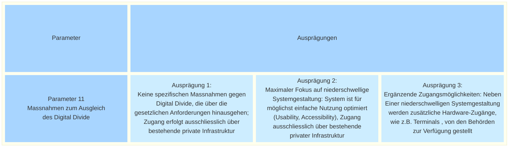

_[Deutsche Version](#d-0)_

## Boîte morphologique : Paramètre 12 - Logique de soutien des récoltes de signatures 

[Le paramètre 4 « Attribution des déclarations de soutien »](https://github.com/swiss/e-collecting/blob/main/docs/morphological-box/parameter-4.md#bo%C3%AEte-morphologique--param%C3%A8tre-4---attribution-des-d%C3%A9clarations-de-soutien) examine la question de savoir si et sous quelle forme les déclarations de soutien doivent être attribuées aux différentes organisations chargées de la récolte. Si l'on décide que le nombre de signatures certifiées par organisation chargée de la récolte doit en principe être attribué, il convient de préciser comment cette attribution pourrait s'effectuer.

Les initiatives populaires sont toujours portées par un comité d’initiative, qui est formellement la seule instance responsable de la récolte des signatures. Dans la pratique, celui-ci est soutenu par d’autres organisations chargées de la récolte, à titre bénévole ou à des fins commerciales. Dans le cas des référendums, les signatures peuvent être recueillies par plusieurs comités indépendamment les uns des autres. De plus, des particuliers peuvent également établir de manière autonome des listes de signatures valides et récolter des signatures, pour autant que les formalités légales soient respectées.

Dans le cadre d’une récolte électronique de signatures pour une requête populaire, la question se pose donc de savoir si, en remettant la déclaration de soutien, il faut également soutenir une organisation de récolte spécifique. Dans un système de récolte électronique, il existe deux possibilités différentes pour ce paramètre : soit le soutien à la requête populaire est obligatoirement lié au soutien à une organisation de récolte, soit le soutien à une organisation de récolte est facultatif et peut être exprimé en plus du soutien à la requête populaire.

Ces options sont-elles, selon vous, présentées de manière exhaustive ? Quels avantages et inconvénients peut-on anticiper pour chaque option ? La discussion à ce sujet a lieu ici.

Il existe des interdépendances avec le paramètre 4. 

## <a name="d-0"> Morphologischer Kasten: Parameter 11 - Massnahmen zum Ausgleich des Digital Divide

Wie kann sichergestellt werden, dass möglichst viele Stimmberechtigte ein E-Collecting-System nutzen können, unabhängig von den Geräten, auf die sie Zugriff haben, oder ihren digitalen Kompetenzen und Fähigkeiten?

Die Ausgestaltung der E-Collecting-Versuche kann unterschiedliche Massnahmen vorsehen, um digitale Hürden abzubauen und den Zugang für möglichst viele Personen zu erleichtern. Dabei können sowohl die möglichst barrierefreie Gestaltung des Systems selbst als auch die verfügbaren Zugangsmöglichkeiten - zum Beispiel private Geräte oder öffentliche Terminals - eine Rolle spielen.

Für digitale Angebote des Bundes gelten bereits verbindliche Anforderungen an die digitale Barrierefreiheit (WCAG 2.1 Level AA und eCH-0059 Accessibility Standard V3.0).  Diese sollen sicherstellen, dass digitale Anwendungen möglichst auch von Menschen mit Behinderungen oder besonderen Unterstützungsbedürfnissen genutzt werden können. Die nachfolgenden Ausprägungen unterscheiden sich darin, ob und in welchem Umfang über diese Mindestanforderungen hinaus zusätzliche Massnahmen zur Verringerung digitaler Zugangshürden vorgesehen werden.

Denkbar wäre auch die Bereitstellung öffentlicher Hardware-Zugänge, um stimmberechtigten Personen, die nicht über geeignete Endgeräte verfügen, die Teilhabe an E-Collecting zu ermöglichen. Vergleichbare Ansätze werden vereinzelt in der Praxis verfolgt. Im deutschen Bundesland Hessen setzen Pilotkommunen sogenannte Bürgerterminals ein, die den Zugang zu digitalen Verwaltungsdiensten ermöglichen. In Portugal unterstützt die Europäische Union sogenannte «citizen spots», physische Anlaufstellen in Gemeinden, an denen Bürgerinnen und Bürger digitale Verwaltungsdienste an Self-Service-Terminals - allein  oder mit Unterstützung durch Gemeindemitarbeiter vor Ort - nutzen können.

Das Spektrum des Parameters reicht also von einem Ansatz, der keine zusätzlichen Massnahmen über die gesetzlichen Anforderungen hinaus vorsieht, über eine besonders benutzerfreundliche und barrierefreie  Systemgestaltung bis hin zur Bereitstellung zusätzlicher öffentlicher Zugangsmöglichkeiten, beispielsweise in Form von Terminals, die von den Behörden zur Verfügung gestellt werden.

Sind die möglichen Ausprägungen dieses Parameters aus Ihrer Sicht vollständig dargestellt? Welche Vor- und Nachteile ergeben sich aus den einzelnen Ausprägungen? Die Dieskussion dazu finder hier statt.

Es bestehen Abhängigkeiten zu Parameter 10. 

