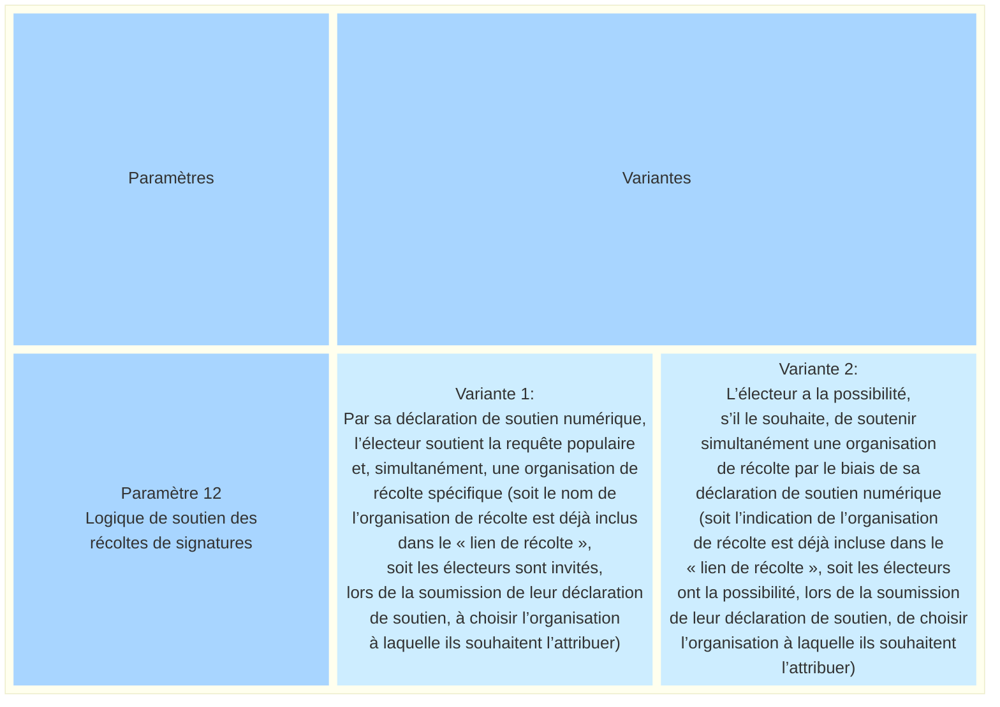
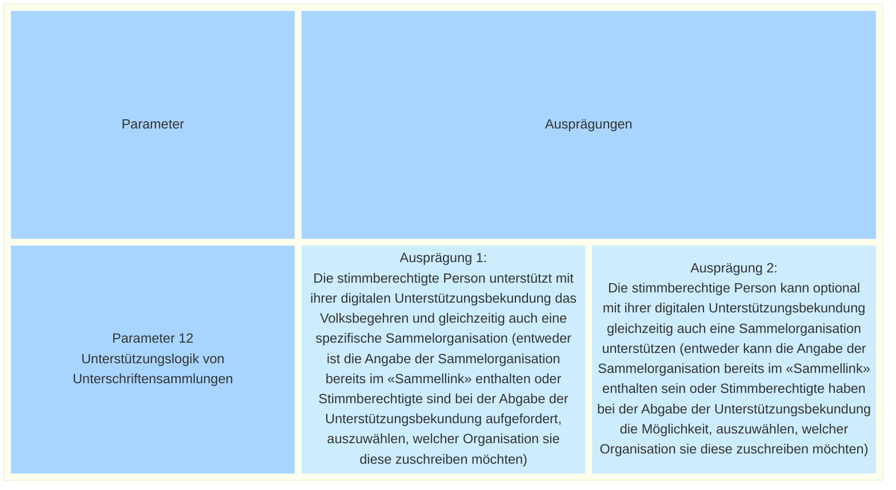

_[Deutsche Version](#d-0)_

## Boîte morphologique : Paramètre 12 - Logique de soutien des récoltes de signatures 

[Le paramètre 4 « Attribution des déclarations de soutien »](https://github.com/swiss/e-collecting/blob/main/docs/morphological-box/parameter-4.md#bo%C3%AEte-morphologique--param%C3%A8tre-4---attribution-des-d%C3%A9clarations-de-soutien) examine la question de savoir si et sous quelle forme les déclarations de soutien doivent être attribuées aux différentes organisations chargées de la récolte. Si l'on décide que le nombre de signatures certifiées par organisation chargée de la récolte doit en principe être attribué, il convient de préciser comment cette attribution pourrait s'effectuer.

Les initiatives populaires sont toujours portées par un comité d’initiative, qui est formellement la seule instance responsable de la récolte des signatures. Dans la pratique, celui-ci est soutenu par d’autres organisations chargées de la récolte, à titre bénévole ou à des fins commerciales. Dans le cas des référendums, les signatures peuvent être recueillies par plusieurs comités indépendamment les uns des autres. De plus, des particuliers peuvent également établir de manière autonome des listes de signatures valides et récolter des signatures, pour autant que les formalités légales soient respectées.

Dans le cadre d’une récolte électronique de signatures pour une requête populaire, la question se pose donc de savoir si, en remettant la déclaration de soutien, il faut également soutenir une organisation de récolte spécifique. Dans un système de récolte électronique, il existe deux possibilités différentes pour ce paramètre : soit le soutien à la requête populaire est obligatoirement lié au soutien à une organisation de récolte, soit le soutien à une organisation de récolte est facultatif et peut être exprimé en plus du soutien à la requête populaire.

Ces options sont-elles, selon vous, présentées de manière exhaustive ? Quels avantages et inconvénients peut-on anticiper pour chaque option ? La discussion à ce sujet a lieu ici.

Il existe des interdépendances avec le paramètre 4. 

## <a name="d-0"> Morphologischer Kasten: Parameter 12 - Unterstützungslogik von Unterschriftensammlungen 

[Parameter 4 «Zuordnung von Unterstützungsbekundungen»](https://github.com/swiss/e-collecting/blob/main/docs/morphological-box/parameter-4.md#-morphologischer-kasten-parameter-4---zuordnung-von-unterst%C3%BCtzungsbekundungen) geht der Frage nach, ob und in welcher Form Unterstützungsbekundungen einzelnen sammelnden Organisationen zugeordnet werden sollen. Entscheidet man sich dafür, dass die Anzahl von bescheinigten Unterschriften pro sammelnde Organisation grundsätzlich zugeordnet werden sollte, muss geklärt werden, wie die Zuordnung entstehen könnte. 

Hinter Volksinitiativen steht stets ein Initiativkomitee, welche formell die einzige verantwortliche Instanz für die Unterschriftensammlung ist. In der Praxis wird sie von weiteren sammelnden Organisationen, auf Freiwilligenbasis oder kommerziell, unterstützt. Bei Referenden können Unterschriften von mehreren Komitees unabhängig voneinander gesammelt werden. Zudem können auch Einzelpersonen eigenständig gültige Unterschriftenlisten erstellen und Unterschriften sammeln, sofern die gesetzlichen Formvorschriften eingehalten werden.

Im Rahmen einer elektronischen Unterschriftensammlung für ein Volksbegehren stellt sich deshalb die Frage, ob mit der Abgabe der Unterstützungsbekundung zusätzlich auch eine bestimmte Sammelorganisation unterstützt werden soll. In einem E-Collecting-System bestehen zwei unterschiedliche Gestaltungsmöglichkeiten für diesen Parameter: Entweder ist die Unterstützung des Volksbegehrens zwingend mit der Unterstützung einer Sammelorganisation verknüpft, oder die Unterstützung einer Sammelorganisation erfolgt freiwillig und kann zusätzlich zur Unterstützung des Volksbegehrens abgegeben werden.

Sind die Ausprägungen aus Ihrer Sicht vollständig dargestellt? Welche Vor- und Nachteile lassen sich bei der Auswahl jeder Ausprägung antizipieren? Die Diskussion dazu findet hier statt.

Es bestehen Abhängigkeiten zu Parameter 4. 

