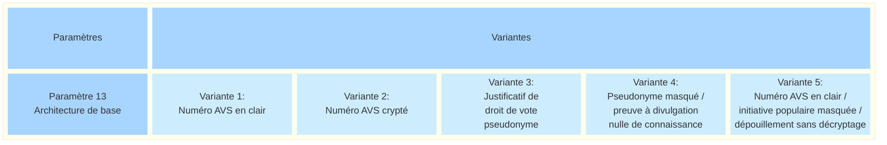
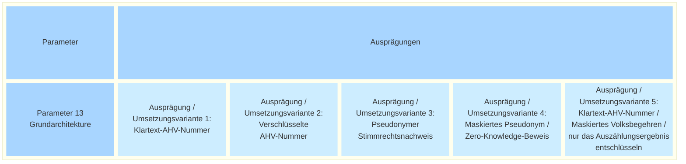

_[Deutsche Version](#d-0)_

## Boîte morphologique : Paramètre 13 - Architecture de base 

Le paramètre « Architecture de base » revêt une importance particulière en raison de sa complexité et de son impact sur les ressources financières et humaines, la sécurité, le calendrier de préparation des essais et, par conséquent, sur le soutien politique dont bénéficient ces essais. C'est pourquoi ce sujet est traité dans un document de travail distinct. Les cinq variantes ont été définies sur la base du hackathon et des discussions qui en ont découlé dans le cadre du processus participatif. Les propositions issues du hackathon qui ne concernent pas l'architecture de base seront prises en compte dans d'autres contextes en vue d'une mise en œuvre concrète.

Dans les variantes de mise en œuvre 1 et 2, le droit de vote est attesté sur la base d’informations personnelles transmises avec la déclaration de soutien (p. ex. numéro AVS). Le déroulement s’inspire ainsi du processus actuel, sur support papier. Dans la variante 1, le système de récolte électronique reçoit les informations d’identité sous une forme lisible et les transmet au registre électoral pour attestation. Dans la variante 2, le système de récolte électronique reçoit les informations d’identité sous une forme cryptée et illisible. Seul le registre électoral est en mesure de décrypter ces informations. 

Dans les variantes de mise en œuvre 3 et 4, le droit de vote est vérifié en amont. Il s’agit là d’une différence fondamentale par rapport au processus actuel, basé sur le papier. Les personnes dont le droit de vote a été vérifié avec un résultat positif se voient attribuer, dans le cadre de la certification, un pseudonyme (éventuellement structuré de manière similaire à un numéro AVS). Les informations transmises avec la déclaration de soutien s’appuient sur ce pseudonyme et attestent du droit de vote sans qu’une vérification supplémentaire dans le registre électoral ne soit nécessaire. Dans la variante 3, le système de récolte électronique reçoit le pseudonyme sous une forme lisible. Dans la variante de mise en œuvre 4, le système de récolte électronique reçoit des preuves à divulgation nulle  de connaissance basées sur le pseudonyme. Le pseudonyme n’est alors pas transmis sous une forme lisible. Cela permet de publier les déclarations de soutien sans porter atteinte au secret du vote. Elles peuvent ensuite être vérifiées et comptabilisées publiquement. Les preuves à divulgation nulle de connaissance attestent du droit de vote d’une personne sans révéler son pseudonyme. Il s’agit d’une catégorie de techniques particulièrement utilisées dans le cadre du vote électronique afin de répondre à des exigences élevées en matière de transparence tout en garantissant le secret du vote.

La variante de mise en œuvre 5 adopte une approche différente pour atteindre le même objectif que la variante 4. Les déclarations de soutien sont transmises sous une forme illisible, mais sans utilisation d'un pseudonyme. Elles peuvent ainsi être publiées et le résultat du dépouillement peut être vérifié publiquement.

**La discussion sur l'architecture de base a lieu [ici](https://github.com/swiss/e-collecting/issues/28).**

Lien: [Document de travail](https://github.com/swiss/e-collecting/raw/refs/heads/main/docs/morphological-box/parameter-13-base-architecture-working-document-FR.pdf)

## <a name="d-0"> Morphologischer Kasten: Parameter 13 - Grundarchitektur

Der Parameter «Grundarchitektur» hat aufgrund seiner Komplexität und seiner Bedeutung für die finanziellen und personellen Aufwände, die Sicherheit, den zeitlichen Fortschritt bei der Vorbereitung der Versuche und damit für den politischen Rückhalt der Versuche per se eine besondere Bedeutung. Deshalb wird er im in einem [gesonderten Arbeitspapier](https://github.com/swiss/e-collecting/raw/refs/heads/main/docs/morphological-box/parameter-13-base-architecture-working-document-DE.pdf) behandelt. Die fünf Ausprägungen wurden auf der Grundlage des Hackathons und der darauf basierenden Gespräche im Rahmen des partizipativen Prozesses definiert. Vorschläge aus dem Hackathon, die nicht die Grundarchitektur beschlagen, werden in anderen Zusammenhängen mit Blick auf die konkrete Umsetzung aufgenommen.

In Umsetzungsvarianten 1 und 2 wird das Stimmrecht gestützt auf persönliche Informationen bescheinigt, die mit der Unterstützungsbekundung mitgeschickt werden (z.B. AHV-Nummer). Der Ablauf orientiert sich damit am aktuellen, papierbasierten Prozess. In Variante 1 erhält das E-Collecting-System die Informationen über die Identität in lesbarer Form und leitet sie ans Stimmregister zur Bescheinigung weiter. In Variante 2 erhält das E-Collecting-System die Informationen über die Identität in verschlüsselter, nichtlesbarer Form. Erst das Stimmregister kann diese Informationen entschlüsseln. 

In Umsetzungsvarianten 3 und 4 wird das Stimmrecht vorgelagert geprüft. Darin besteht eine elementare Abweichung vom aktuellen, papierbasierten Prozess. Personen, deren Stimmrecht mit positivem Ergebnis geprüft wurde, wird im Rahmen der Bescheinigung ein Pseudonym (ev. ähnlich aufgebaut wie eine AHV-Nummer) zugewiesen. Die mit der Unterstützungsbekundung mitgeschickten Informationen stützen sich auf das Pseudonym und belegen das Stimmrecht, ohne dass eine weitere Überprüfung im Stimmregister nötig ist. In Variante 3 erhält das E-Collecting-System das Pseudonym in lesbarer Form. In Umsetzungsvariante 4 erhält das E-Collecting-System Zero-Knowledge-Beweise auf Basis des Pseudonyms. Das Pseudonym wird dabei nicht in lesbarer Form übermittelt. Dadurch können Unterstützungsbekundungen veröffentlicht werden, ohne das Stimmgeheimnis zu verletzen. Anschliessend können sie öffentlich geprüft und gezählt werden. Die Zero-Knowledge-Beweise beweisen das Stimmrecht einer Person, ohne das Pseudonym offenzulegen. Es handelt sich um eine Klasse von Techniken, die insbesondere für E-Voting zum Einsatz kommt, um hohen An-sprüchen an Transparenz unter gleichzeitiger Gewährung des Stimmgeheimnisses gerecht zu werden.

Umsetzungsvariante 5 verfolgt einen anderen Ansatz, um dasselbe Ziel wie Umsetzungsvariante 4 zu erreichen. Die Unterstützungsbekundungen werden in nicht lesbarer Form übermittelt, jedoch ohne Verwendung eines Pseudonyms. Dadurch können sie veröffentlicht werden und das Ergebnis der Auszählung kann öffentlich geprüft werden.

**Die Diskussion über die Grundarchitektur findet [hier](https://github.com/swiss/e-collecting/issues/28) statt.**

Link: [Arbeitspapier Grundarchitektur](https://github.com/swiss/e-collecting/raw/refs/heads/main/docs/morphological-box/parameter-13-base-architecture-working-document-DE.pdf)

