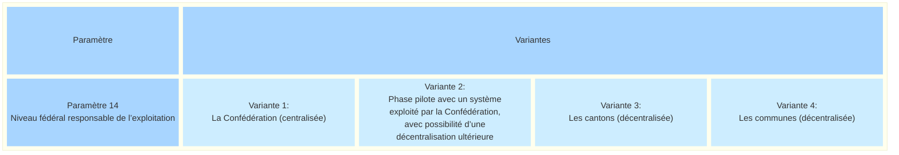
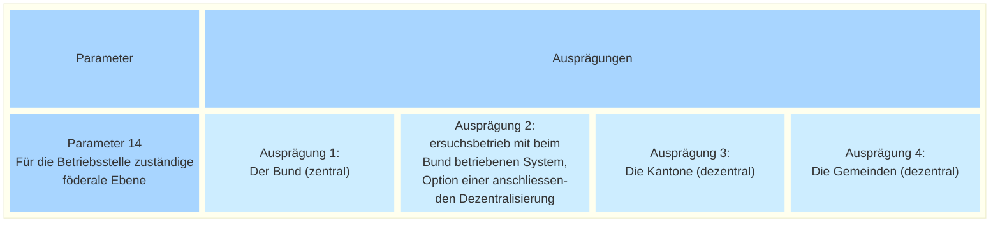

_[Deutsche Version](#d-0)_

## Boîte morphologique : Paramètre 14 - Niveau fédéral responsable de l’exploitation

Les différentes motions de même teneur déposées par les Chambres fédérales concernant la récolte électronique de signatures (24.3905, 24.3908, 24.3909, 24.3910, 24.3911 et 24.3912) exigeaient une mise en œuvre décentralisée. Cette exigence a été précisée dans la loi fédérale sur les droits politiques (LDP), qui prévoit que l’attestation du droit de vote doit être effectuée de manière décentralisée ([LDP](https://www.fedlex.admin.ch/eli/fga/2026/1765/de#mod_u12)). 

Dans le rapport faisant suite au postulat et ayant précédé la révision de la LDP, le Conseil fédéral avait déjà posé les jalons en décrivant l’exploitation d’une plateforme de récolte électronique de signatures  comme relevant de la compétence de l’État ([Rapport](https://www.news.admin.ch/de/nsb?id=103228), p. 39).

Dans les faits, la grande majorité des cantons a toutefois indiqué que l’exploitation à leur échelon administratif d’une plateforme de récolte électronique de signatures n’était pas envisageable.  Les cantons de Saint-Gall et de Genève font exception, puisqu’ils investissent dans leurs propres systèmes cantonaux.

Il est également envisageable que les quelque 2 000 communes suisses exploitent leurs propres systèmes ou se regroupent au sein d’associations de communes. Si l’on optait pour un système fédéral, les initiatives et référendums aux niveaux cantonal et communal seraient également traités via le système fédéral. Les services compétents des cantons et des communes disposeraient des accès correspondants.

Afin d’assurer un démarrage rapide de la phase pilote, un système fédéral apparaît comme une solution appropriée. Cela n’exclut toutefois pas la possibilité de prévoir à l’avenir une exploitation décentralisée par les cantons.

Même en cas de recours à un système fédéral, l’attestation du droit de vote continuerait d’être effectuée de manière décentralisée. Cette exigence figure également dans la LDP.

Les questions abordées dans ce paramètre ont également été traitées dans une proposition de paramètre alternative de la Fondation pour la démocratie directe ([NEU Parameter N-18 - Wer betreibt die Plattform im Versuchsbetrieb?](https://github.com/swiss/e-collecting/issues/33)).

Les différentes valeurs possibles de ce paramètre sont-elles, selon vous, toutes présentées ? Quelles seraient les conséquences possibles du choix de l'une de ces valeurs ? **La discussion à ce sujet a lieu [ici](https://github.com/swiss/e-collecting/issues/46).**

## <a name="d-0"> Morphologischer Kasten: Parameter 14 - Für die Betriebsstelle zuständige föderale Ebene

Die verschiedenen gleichlautenden Motionen der eidgenössischen Räte zu E-Collecting (24.3905, 24.3908, 24.3909, 24.3910, 24.3911 und 24.3912) verlangten eine dezentrale Umsetzung. Diese Anforderung wurde im Bundesgesetz über die politischen Rechte (BPR) dahingehend präzisiert, dass die Stimmrechtsbescheinigung dezentral zu erfolgen habe ([BPR](https://www.fedlex.admin.ch/eli/fga/2026/1765/de#mod_u12)).

Im Postulatsbericht, welcher der BPR-Revision vorausging, spurte der Bundesrat vor, indem er den Betrieb einer E-Collecting-Plattform als staatliche Aufgabe beschrieb ([Bericht](https://www.news.admin.ch/de/nsb?id=103228), S. 39). 

Tatsächlich signalisierte die grosse Mehrheit der Kantone aber, dass sie sich einen Betrieb einer E-Collecting Plattform für den Moment nicht vorstellen können. Ausnahmen bilden die Kantone St.Gallen und Genf, die in eigene kantonale Systeme investieren.

Es ist auch denkbar, dass die rund 2'000 Schweizer Gemeinden eigene Systeme betreiben oder sich zu Gemeindeverbänden zusammenschliessen. Würde man auf das Bundessystem setzen, dann würden auch Volksbegehren auf kantonaler und kommunaler Ebene über das Bundessystem abgewickelt. Die zuständigen Stellen bei Kantonen und Gemeinden würden über entsprechende Zugriffe verfügen.

Im Sinn eines raschen Versuchsstarts erscheint ein Bundessystem als zielführend. Dies schliesst aber nicht aus, dass man künftig eine dezentrale Betriebsstelle bei den Kantonen vorsehen könnte.

Auch beim Einsatz eines Bundessystems würde die Bescheinigung des Stimmrechts weiterhin dezentral erfolgen. Dies wird auch so im BPR gefordert.

Die Fragen in diesem Parameter wurden auch in einem alternativen Parameter-Vorschlag der Stiftung für direkte Demokratie ([NEU Parameter N-18 - Wer betreibt die Plattform im Versuchsbetrieb?](https://github.com/swiss/e-collecting/issues/33)) thematisiert.

Sind die möglichen Ausprägungen dieses Parameters aus Ihrer Sicht vollständig dargestellt? Welche möglichen Auswirkungen hätte die Auswahl einer der möglichen Ausprägungen? **Die Diskussion dazu findet [hier](https://github.com/swiss/e-collecting/issues/46) statt.**

