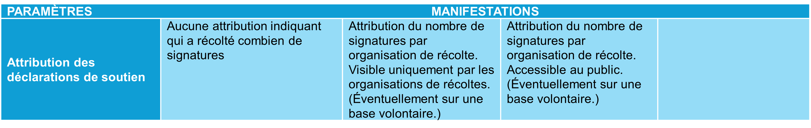
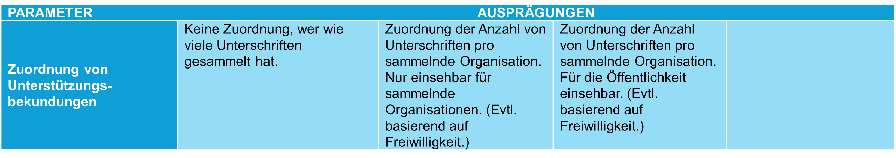

_[Deutsche Version](#d-0)_

## Boîte morphologique : Paramètre 4 - Attribution des déclarations de soutien

Les comités d'initiative et les comités référendaires, les organisations de récolte et les entreprises de récolte peuvent aujourd'hui retracer le nombre de signatures qu'ils ont recueillies. S'il existe plusieurs comités d’initiatives ou référendaires, le nombre de signatures qu'ils ont recueillies ou qui ont été recueillies en leur nom influe sur l'espace qui leur est accordé dans les explications du Conseil fédéral. Cette transparence est importante tant pour les comités d’initiative que pour les comités référendaires pour d’autres raisons : elle permet de déterminer la contribution apportée par les organisations de récolte subordonnées à la récolte de signatures et dans quelle mesure ces dernières doivent, le cas échéant, être indemnisées.

Avec la mise en place d’un système de récolte électronique de signatures, la question se pose de savoir si et sous quelle forme les déclarations de soutien doivent être attribuées aux différentes organisations de récolte. Différentes options sont envisageables : d’un système qui rompt avec la pratique actuelle et ne permet aucune attribution aux organisations de récolte, à des modèles dans lesquels une attribution est prévue, soit uniquement pour les organisations de récolte elles-mêmes, soit accessible au public. Dans les cas 2) et 3), il pourrait être prévu que les personnes ayant le droit de vote choisissent activement ou soient invitées, après avoir exprimé leur soutien, à indiquer si une attribution peut avoir lieu. 

La conception technique concrète de l'attribution reste pour l'instant ouverte. On pourrait, par exemple, imaginer que les organisations de récolte reçoivent un lien spécifique ou un code QR permettant d'attribuer les déclarations de soutien à leur récolte respective. Si la mobilisation se fait par exemple dans la rue, la personne ayant le droit de vote pourrait accéder directement à la page de soutien spécifique à l'organisation en scannant le code QR correspondant.

Lors de la mise en œuvre concrète, il faudrait tenir compte du principe de minimisation des données. Dans des cas extrêmes, certaines solutions techniques d’attribution pourraient conduire un comité à enregistrer une récolte distincte pour chaque électeur et à envoyer un lien direct dans le but de suivre quels électeurs soutiennent telle initiative populaire ou tel référendum.  

Les différentes options sont-elles, selon vous, présentées de manière exhaustive ? Quels avantages et inconvénients peut-on anticiper pour chacune d’elles ? La discussion à ce sujet a lieu [ici](https://github.com/swiss/e-collecting/issues/17).

Cette question a déjà été abordée lors du dialogue participatif :
*	[Résumé des arguments](https://github.com/swiss/e-collecting/blob/main/docs/summaries/first-summary-online-dialogue.md#discussion-6--attribution-des-d%C3%A9clarations-de-soutien)  
*	[Discussion](https://github.com/swiss/e-collecting/issues/6) 

## <a name="d-0"> Morphologischer Kasten: Parameter 4 - Zuordnung von Unterstützungsbekundungen

Initiativ- und Referendumskomitees, Sammelorganisationen und Sammlungsunternehmen können heute die Anzahl ihrer erzielten Unterschriften rückverfolgen. Gibt es bei Referenden mehrere Referendumskomitees, so wirkt sich die Anzahl ihrer oder der in ihrem Namen gesammelten Unterschriften auf den für sie eingeräumten Platz in den Erläuterungen des Bundesrates aus. Sowohl für Initiativkomitees als auch für Referendumskomitees ist diese Transparenz aus weiteren Gründen relevant: Sie ermöglicht nachzuvollziehen, welche untergeordneten Sammelorganisationen welchen Beitrag zur Unterschriftensammlung geleistet haben und in welchem Umfang sie gegebenenfalls entschädigt werden müssen.

Mit dem Einsatz eines E-Collecting-Systems stellt sich die Frage, ob und in welcher Form Unterstützungsbekundungen einzelnen sammelnden Organisationen zugeordnet werden sollen. Dabei sind unterschiedliche Ausprägungen denkbar: von einem System, das mit der heutigen Praxis bricht und keine Zuordnung zu den Sammelorganisationen zulässt, über Modelle, in denen eine Zuordnung vorgesehen ist, entweder nur für die sammelnden Organisationen selbst oder öffentlich einsehbar. Bei Ausprägungen 2) und 3)  könnte vorgesehen werden, dass stimmberechtigte Personen aktiv auswählen oder nach Abgabe ihrer Unterstützungsbekundung gefragt werden, ob eine Zuordnung erfolgen darf. 

Die konkrete technische Ausgestaltung der Zuordnung bleibt dabei für den Moment offen. Denkbar wäre etwa, dass Sammelorganisationen einen spezifischen Link oder QR-Code erhalten, über den Unterstützungsbekundungen ihrer jeweiligen Sammlung zugeordnet werden können. Wird beispielweise auf der Strasse mobilisiert, könnte durch das Scannen des entsprechenden QR-Codes die stimmberechtigte Person direkt zur organisationsspezifischen Unterstützungsseite gelangen.

Bei der konkreten Umsetzung wäre das Prinzip der Datensparsamkeit zu berücksichtigen. Bestimmte technische Lösungen zur Zuordnung könnten im Extremfall dazu führen, dass ein Komitee pro stimmberechtigte Person eine eigenständige Sammlung registriert und einen direkten Link mit dem Ziel versendet, zu verfolgen, welche stimmberechtigte Person ein Volksbegehren unterstützt.  

Sind die Ausprägungen aus Ihrer Sicht vollständig dargestellt? Welche Vor- und Nachteile lassen sich bei der Auswahl jeder Ausprägung antizipieren? Die Diskussion dazu findet [hier](https://github.com/swiss/e-collecting/issues/17) statt.

Diese Frage wurde im partizipativen Dialog bereits erörtert:
* [Zusammenfassung der Argumente](https://github.com/swiss/e-collecting/blob/main/docs/summaries/first-summary-online-dialogue.md#diskussion-6-zuschreibung-der-unterst%C3%BCtzungsbekundungen)
* [Diskussion](https://github.com/swiss/e-collecting/issues/6)

