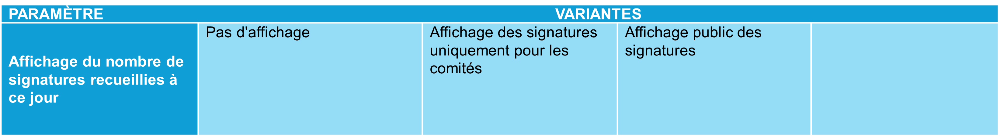

_[Deutsche Version](#d-0)_

## Boîte morphologique : Paramètre 5 - Affichage du nombre de signatures recueillies à ce jour

Les comités d’initiative et référendaires ont aujourd’hui une vue d’ensemble du nombre de signatures qu’ils ont recueillies à un moment donné pendant la période de récolte. Le public ne reçoit ces informations que par le biais des déclarations des comités. Avec l’introduction d’un système de récolte électronique, la question se pose de savoir si et sous quelle forme l’état actuel de la récolte de signatures doit être rendu public.

L'affichage du nombre de signatures recueillies peut prendre différentes formes : cela va de l'absence totale d'affichage à une présentation publique des signatures recueillies à ce jour, en passant par des formules dans lesquelles ces informations ne sont accessibles qu'aux comités eux-mêmes. Cela suppose que les déclarations de soutien sur papier soient saisies numériquement dans le système de récolte électronique après leur certification par les communes ([paramètre 1.1](docs/morphological-box/parameter-1-1.md)) et que, lors d'un affichage, l'origine d'une déclaration de soutien – numérique ou sur papier – soit indiquée.

Les différentes valeurs possibles de ce paramètre sont-elles, selon vous, toutes présentées ? Quelles seraient les conséquences possibles du choix de l'une de ces valeurs ? La discussion à ce sujet a lieu [ici](https://github.com/swiss/e-collecting/issues/18).

 

## <a name="d-0"> Morphologischer Kasten: Parameter 5 - Anzeige der Anzahl bisher gesammelter Unterschriften

Initiativ- und Referendumskomitees haben heute einen Überblick darüber, wie viele Unterschriften sie zu einem bestimmten Zeitpunkt während der Sammeldauer erreicht haben. Die Öffentlichkeit erhält diese Informationen nur durch Aussagen der Komitees. Mit der Einführung eines E-Collecting-Systems stellt sich die Frage, ob und in welcher Form der aktuelle Stand der Unterschriftensammlung sichtbar gemacht werden soll.

Die Anzeige der Anzahl gesammelter Unterschriften kann dabei unterschiedlich ausgestaltet werden: von einem vollständigen Verzicht auf jegliche Anzeige, über Formen, bei denen entsprechende Informationen ausschliesslich den Komitees selbst zugänglich sind, bis hin zu einer öffentlichen Darstellung der bislang gesammelten Unterschriften. Dies setzt voraus, dass papierbasierte Unterstützungsbekundungen nach ihrer Bescheinigung durch die Gemeinden digital im E-Collecting-System erfasst werden ([Parameter 1.1](docs/morphological-box/parameter-1-1.md)) und bei einer Anzeige der Ursprung einer Unterstützungsbekundung – digital oder papierbasiert – ausgewiesen wird.

Sind die möglichen Ausprägungen dieses Parameters aus Ihrer Sicht vollständig dargestellt? Welche möglichen Auswirkungen hätte die Auswahl einer der möglichen Ausprägungen? Die Diskussion dazu findet [hier](https://github.com/swiss/e-collecting/issues/18) statt.

