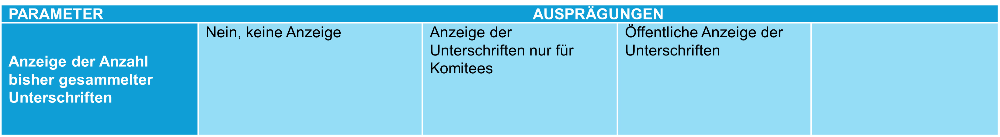

## Parameter 5: Anzeige der Anzahl bisher gesammelter Unterschriften

Initiativ- und Referendumskomitees haben heute einen Überblick darüber, wie viele Unterschriften sie zu einem bestimmten Zeitpunkt während der Sammeldauer erreicht haben. Die Öffentlichkeit erhält diese Informationen nur durch Aussagen der Komitees. Mit der Einführung eines E-Collecting-Systems stellt sich die Frage, ob und in welcher Form der aktuelle Stand der Unterschriftensammlung sichtbar gemacht werden soll.

Die Anzeige der Anzahl gesammelter Unterschriften kann dabei unterschiedlich ausgestaltet werden: von einem vollständigen Verzicht auf jegliche Anzeige, über Formen, bei denen entsprechende Informationen ausschliesslich den Komitees selbst zugänglich sind, bis hin zu einer öffentlichen Darstellung der bislang gesammelten Unterschriften. Dies setzt voraus, dass papierbasierte Unterstützungsbekundungen nach ihrer Bescheinigung durch die Gemeinden digital im E-Collecting-System erfasst werden (Parameter 1.1) und bei einer Anzeige der Ursprung einer Unterstützungsbekundung – digital oder papierbasiert – ausgewiesen wird.

Sind die möglichen Ausprägungen dieses Parameters aus Ihrer Sicht vollständig dargestellt? Welche möglichen Auswirkungen hätte die Auswahl einer der möglichen Ausprägungen?

