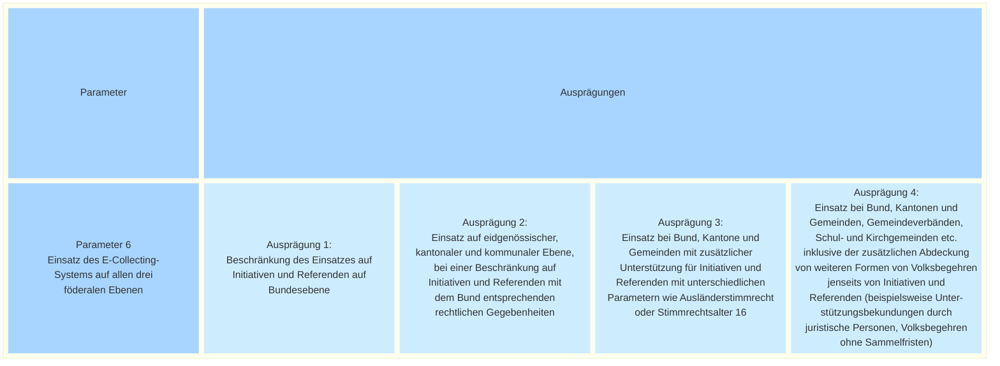

_[Deutsche Version](#d-0)_

## Boîte morphologique : Paramètre 6 - Mise en œuvre du système de récolte électronique aux trois niveaux fédéraux

A suivre

## <a name="d-0"> Morphologischer Kasten: Parameter 6 - Einsatz des E-Collecting-Systems auf allen drei föderalen Ebenen

Es stellt sich die Frage, ob die Versuche sich auf die Bundesebene beschränken sollen oder ob es sinnvoller wäre, von Anfang an auch kantonale und kommunale Volksbegehren in die Versuche einzubeziehen. 

Konsequent zu Ende gedacht könnte ein E-Collecting-System also neben dem Bund auch die Bedürfnisse von Kantonen, Gemeinden sowie weiteren Körperschaften wie Gemeindeverbänden, Schul- und Kirchgemeinden abdecken.

Eine Abklärung der Bundeskanzlei hat ergeben, dass auf Kantons- und Gemeindestufe zum Teil andere rechtliche Gegebenheiten gelten (Ausländerstimmrecht, Stimmrechtsalter 16). Darüber hinaus existieren alternative Formen von Volksbegehren, die auf Bundesebene unbekannt sind (z.B. Gesetzesinitiativen, Unterstützungsbekundungen durch juristische Personen, Volksbegehren ohne Sammelfristen). Diese Unterschiede müssen bei der Planung eines Systems mitgedacht werden, was zusätzliche Aufwände bedeutet.

Die Nutzung des E-Collecting-Systems auf mehreren föderalen Ebenen führt also zu einer Erhöhung der Komplexität und der Kosten.

Sind die möglichen Ausprägungen dieses Parameters aus Ihrer Sicht vollständig dargestellt? Welche möglichen Auswirkungen hätte die Auswahl einer der möglichen Ausprägungen? **Die Diskussion dazu findet [hier](https://github.com/swiss/e-collecting/issues/19) statt.**

