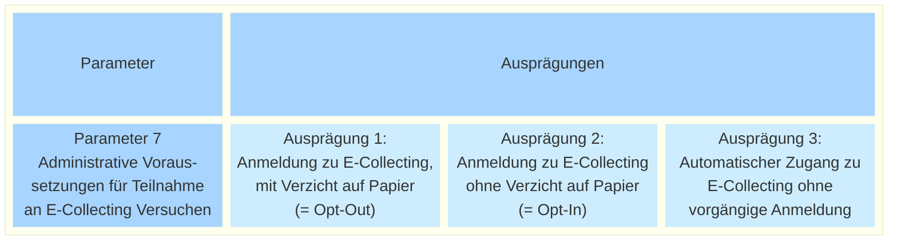

_[Deutsche Version](#d-0)_

## Boîte morphologique : Paramètre 7 - Conditions administratives requises pour participer aux essais de récolte électronique

A suivre

## <a name="d-0"> Morphologischer Kasten: Parameter 7 - Administrative Voraussetzungen für Teilnahme an E-Collecting Versuchen

Wenn man verhindern will, dass eine stimmberechtigte Person ihre Unterstützung auf Papier und gleichzeitig auf dem digitalen Kanal leistet (= Doppelunterschrift), führt dies zu technischem Mehraufwand.

Man könnte diesen Aufwand vermeiden, indem man sämtliche Stimmberechtigten dazu zwingt, sich zwischen Papier und E-Collecting zu entscheiden (= Opt-Out). Dies führt allerdings zu administrativen und rechtlichen Problemen. Diese Schwierigkeiten wurden im schriftlichen Dialog bereits diskutiert.

* [Link Diskussion](https://github.com/swiss/e-collecting/issues/2)
* [Link Zusammenfassung der Diskussion](https://github.com/swiss/e-collecting/blob/main/docs/summaries/first-summary-online-dialogue.md#diskussion-2-l%C3%A4sst-sich-ein-opt-out-f%C3%BCr-den-papierprozess-wirklich-vermeiden)

Dennoch wird der Parameter noch einmal formell zur Diskussion gestellt.

Unabhängig von der hier diskutierten Frage definiert der Gesetzgeber im Entwurf für die Teilrevision des Bundesgesetzes über die politischen Rechte weitere Einschränkungen wie etwa eine anteilsmässige Beschränkung der digitalen Unterstützungsbekundungen. Dies ist aber nicht Teil des hier behandelten Parameters. Hier geht es ausschliesslich um die Teilnahme-Voraussetzungen für die einzelnen Stimmberechtigten.

Sind die möglichen Ausprägungen dieses Parameters aus Ihrer Sicht vollständig dargestellt? Welche möglichen Auswirkungen hätte die Auswahl einer der möglichen Ausprägungen? **Die Diskussion dazu findet [hier](https://github.com/swiss/e-collecting/issues/20) statt.**

