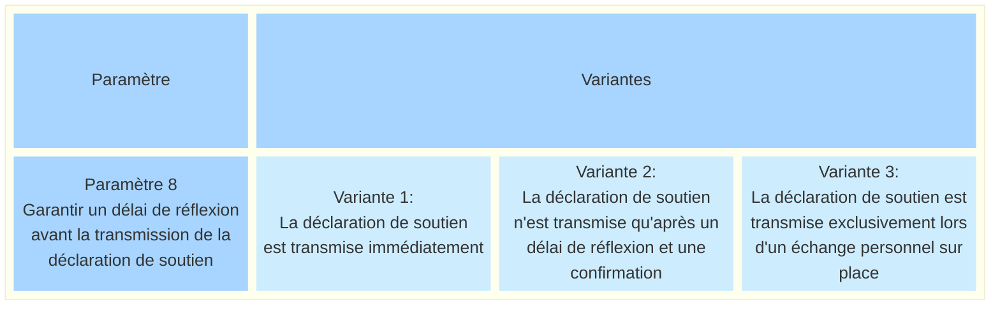
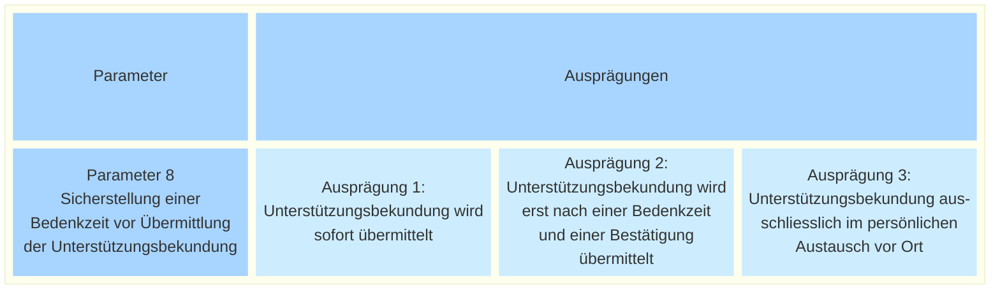

_[Deutsche Version](#d-0)_

## Boîte morphologique : Paramètre 8 - Garantir un délai de réflexion avant la transmission de la déclaration de soutien

Les détracteurs craignent que la récolte électronique de signatures n'entraîne une avalanche d'initiatives populaires. D'autres voix s'attendent à ce que la numérisation des initiatives populaires conduise à moins de discussions et de réflexions : des déclarations de soutien émotionnelles et impulsives seraient formulées trop facilement. Selon ces voix, cela nuirait à la culture politique.

On pourrait y remédier, au moins pendant la phase d'essai, en ne transmettant pas immédiatement une déclaration de soutien, mais seulement après confirmation. Cette confirmation ne pourrait être donnée qu'après un délai de réflexion (la durée exacte resterait à définir : cela pourrait être au plus tôt après 10 minutes, ou peut-être même seulement le lendemain).

Ce délai de réflexion freinerait les déclarations de soutien précipitées et, idéalement, renforcerait le dialogue ainsi que la conviction durable.

Le processus avec délai de réflexion serait comparable au fait de remplir le formulaire papier et de le déposer séparément dans une boîte aux lettres à un moment ultérieur (par exemple, à la prochaine occasion à proximité d’une boîte aux lettres).

La question se pose de savoir si un tel délai de réflexion dans le système de récolte électronique serait légalement admissible et s’il n’affecterait pas l’accessibilité.

En lien avec la question qui nous occupe ici, une variante proposée lors du hackathon (FIXME:Link) limitait la déclaration de soutien numérique aux échanges personnels sur place. Une signature numérique ne pourrait être apposée que si un représentant ou une représentante d’une campagne fait publiquement campagne auprès des électeurs pour obtenir leur soutien à une initiative populaire. Les campagnes en ligne ou les déclarations de soutien depuis son canapé seraient ainsi exclues.

Les différentes valeurs possibles de ce paramètre sont-elles, selon vous, toutes présentées ? Quelles seraient les conséquences possibles du choix de l'une de ces valeurs ? **La discussion à ce sujet a lieu [ici](https://github.com/swiss/e-collecting/issues/21).**

## <a name="d-0"> Morphologischer Kasten: Parameter 8 - Sicherstellung einer Bedenkzeit vor Übermittlung der Unterstützungsbekundung

Kritiker befürchten durch E-Collecting eine Flut von Volksbegehren. Andere Stimmen erwarten, dass die Digitalisierung von Volksbegehren dazu führt, dass weniger diskutiert und weniger nachgedacht wird: Emotionale, impulsive Unterstützungsbekundungen würden allzu einfach geleistet werden. Dies wiederum würde laut diesen Stimmen die politische Kultur beeinträchtigen.

Dem könnte zumindest während des Versuchsbetriebs begegnet werden, indem eine geleistete Unterstützungsbekundung nicht sofort, sondern erst nach einer Bestätigung übermittelt wird. Diese Bestätigung könnte erst nach Ablauf einer Bedenkzeit erteilt werden (der genaue Zeitrahmen wäre zu definieren: Das könnte frühestens nach 10 Minuten sein, oder vielleicht auch erst am nächsten Tag).

Diese Bedenkzeit würde überhastete Unterstützungsbekundungen bremsen und der Dialog und die nachhaltige Überzeugung würden idealerweise gestärkt.

Der Ablauf mit Bedenkzeit wäre vergleichbar mit dem Ausfüllen des Papierbogens und dem separaten Einwerfen in den Briefkasten zu einem späteren Zeitpunkt (z.B bei nächster Gelegenheit in Nähe eines Briefkastens).

Es stellt sich die Frage, ob eine solche Bedenkzeit des E-Collecting-Systems rechtlich zulässig wäre und ob damit nicht die Barrierefreiheit tangiert würde.

Verwandt mit der hier vorliegenden Fragestellung beschränkte eine im Hackathon vorgeschlagene Variante die digitale Unterstützungsbekundung auf den persönlichen Austausch vor Ort. Eine digitale Unterschrift dürfte dabei nur dann geleistet werden, wenn ein Vertreter oder eine Vertreterin einer Kampagne in der Öffentlichkeit bei den Stimmberechtigten für die Unterstützung eines Volksbegehrens wirbt. Online-Kampagnen oder Unterstützungsbekundungen vom Sofa aus würden dadurch ausgeschlossen.

Sind die möglichen Ausprägungen dieses Parameters aus Ihrer Sicht vollständig dargestellt? Welche möglichen Auswirkungen hätte die Auswahl einer der möglichen Ausprägungen? **Die Diskussion dazu findet [hier](https://github.com/swiss/e-collecting/issues/21) statt.**

