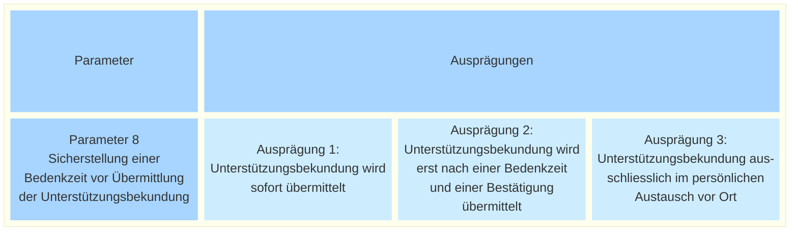

_[Deutsche Version](#d-0)_

## Boîte morphologique : Paramètre 8 - Garantir un délai de réflexion avant l'envoi de la déclaration de soutien

A suivre

## <a name="d-0"> Morphologischer Kasten: Parameter 8 - Sicherstellung einer Bedenkzeit vor Übermittlung der Unterstützungsbekundung

Kritiker befürchten durch E-Collecting eine Flut von Volksbegehren. Andere Stimmen erwarten, dass die Digitalisierung von Volksbegehren dazu führt, dass weniger diskutiert und weniger nachgedacht wird: Emotionale, impulsive Unterstützungsbekundungen würden allzu einfach geleistet werden. Dies wiederum würde laut diesen Stimmen die politische Kultur beeinträchtigen.

Dem könnte zumindest während des Versuchsbetriebs begegnet werden, indem eine geleistete Unterstützungsbekundung nicht sofort, sondern erst nach einer Bestätigung übermittelt wird. Diese Bestätigung könnte erst nach Ablauf einer Bedenkzeit erteilt werden (der genaue Zeitrahmen wäre zu definieren: Das könnte frühestens nach 10 Minuten sein, oder vielleicht auch erst am nächsten Tag).

Diese Bedenkzeit würde überhastete Unterstützungsbekundungen bremsen und der Dialog und die nachhaltige Überzeugung würden idealerweise gestärkt.

Der Ablauf mit Bedenkzeit wäre vergleichbar mit dem Ausfüllen des Papierbogens und dem separaten Einwerfen in den Briefkasten zu einem späteren Zeitpunkt (z.B bei nächster Gelegenheit in Nähe eines Briefkastens).

Es stellt sich die Frage, ob eine solche Bedenkzeit des E-Collecting-Systems rechtlich zulässig wäre und ob damit nicht die Barrierefreiheit tangiert würde.

Verwandt mit der hier vorliegenden Fragestellung beschränkte eine im Hackathon vorgeschlagene Variante die digitale Unterstützungsbekundung auf den persönlichen Austausch vor Ort. Eine digitale Unterschrift dürfte dabei nur dann geleistet werden, wenn ein Vertreter oder eine Vertreterin einer Kampagne in der Öffentlichkeit bei den Stimmberechtigten für die Unterstützung eines Volksbegehrens wirbt. Online-Kampagnen oder Unterstützungsbekundungen vom Sofa aus würden dadurch ausgeschlossen.

Sind die möglichen Ausprägungen dieses Parameters aus Ihrer Sicht vollständig dargestellt? Welche möglichen Auswirkungen hätte die Auswahl einer der möglichen Ausprägungen? **Die Diskussion dazu findet [hier](https://github.com/swiss/e-collecting/issues/21) statt.**

