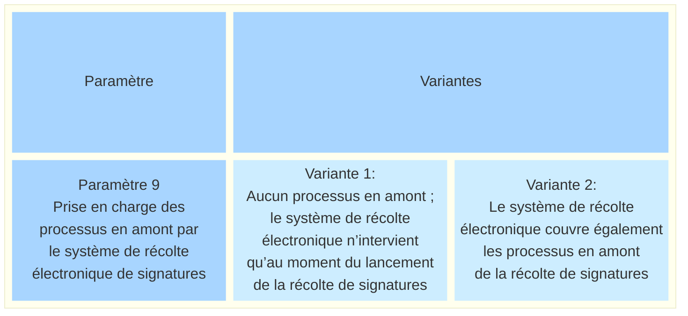
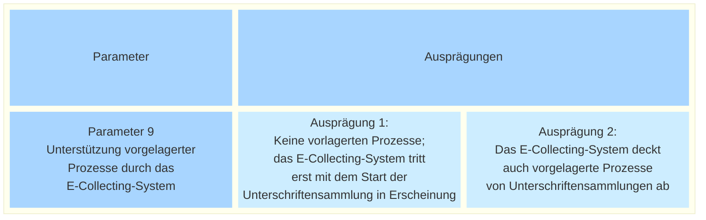

_[Deutsche Version](#d-0)_

## Boîte morphologique : Paramètre 9 - Prise en charge des processus en amont par le système de récolte électronique de signatures

Ce paramètre décrit dans quelle mesure un système de récolte électronique doit, avant même le processus de récolte proprement dit d’une requête populaire, aider les acteurs à mener à bien leurs processus et leur fournir les fonctionnalités correspondantes. Au niveau fédéral, il s’agit d’une part de soutenir la procédure d’examen préalable des initiatives populaires conformément à l’art. 69 de la loi fédérale sur les droits politiques (art. 69 LDP ; RS 161.1) et à l’art. 23 de l’ordonnance sur les droits politiques (art. 23 ODP ; RS 161.11) : Avant le début de la récolte des signatures, la Chancellerie fédérale examine et traduit le texte de l’initiative, vérifie la liste des signatures et constate, par décision, si celle-ci est conforme aux exigences légales. Pour les référendums, la loi ne prévoit pas de procédure d’examen préalable ; dans la pratique, toutefois, les listes de signatures sont généralement examinées par la Chancellerie fédérale sur demande, sans qu’une décision ne soit rendue.

Les formulations sont volontairement générales. L’objectif est tout d’abord de clarifier la question fondamentale de savoir si le soutien aux processus en amont doit faire partie intégrante d’un système de récolte électronique. Les étapes concrètes du processus qui bénéficieront d’un soutien numérique, ainsi que l’étendue de ce soutien, devront être définies ultérieurement.

Selon vous, un système de récolte électronique devrait-il également prendre en charge les processus en amont ? La prise en charge des processus en amont pourrait contribuer à numériser de manière plus cohérente les procédures administratives liées aux requêtes populaires, à réduire les ruptures de médias et à accroître l’efficacité pour les acteurs concernés. La complexité accrue du système de récolte électronique qui en résulterait pourrait toutefois militer contre la prise en charge des procédures en amont. Cela impliquerait probablement un effort de développement supplémentaire ainsi que des coûts plus élevés.

Les différentes valeurs possibles de ce paramètre sont-elles, selon vous, toutes présentées ? Quelles seraient les conséquences possibles du choix de l'une de ces valeurs ? **La discussion à ce sujet a lieu [ici]
(https://github.com/swiss/e-collecting/issues/24).**

## <a name="d-0"> Morphologischer Kasten: Parameter 9 - Unterstützung vorgelagerter Prozesse durch das E-Collecting-System

Dieser Parameter beschreibt, in welchem Umfang ein E-Collecting-System bereits vor dem eigentlichen Sammelprozess eines Volksbegehrens die Akteurinnen und Akteure bei der Führung ihrer Prozesse unterstützen und entsprechende Funktionalität bereitstellen soll. Dabei handelt es sich auf Bundesebene einerseits um die Unterstützung des Vorprüfungsverfahrens von Volksinitiativen nach Art. 69 des Bundesgesetzes über die politischen Rechte (Art. 69 BPR; SR 161.1) und Art. 23 der Verordnung über die politischen Rechte (Art. 23 VPR; SR 161.11 ):   Vor Beginn der Unterschriftensammlung prüft und übersetzt die Bundeskanzlei den Initiativtext, prüft die Unterschriftenliste und stellt durch Verfügung fest, ob die Unterschriftenliste den gesetzlichen Formen entspricht. Für Referenden ist gesetzlich kein Vorprüfungsverfahren vorgesehen; in der Praxis werden die Unterschriftenlisten auf Anfrage jedoch in der Regel von der Bundeskanzlei geprüft, ohne dass eine Verfügung ergeht.

Die Ausprägungen sind bewusst allgemein gehalten. Ziel ist es, zunächst die grundsätzliche Frage zu klären, ob die Unterstützung für vorgelagerte Prozesse Bestandteil eines E-Collecting-Systems sein soll. Welche konkreten Prozessschritte digital unterstützt werden, und in welchem Umfang dies erfolgt, wäre zu einem späteren Zeitpunkt zu definieren.

Sollte ein E-Collecting-System aus Ihrer Sicht auch vorgelagerte Prozesse unterstützen?   Die Unterstützung vorgelagerter Prozesse könnte dazu beitragen, die administrativen Abläufe im Zusammenhang mit Volksbegehren durchgängiger digital abzubilden, Medienbrüche zu reduzieren und die Effizienz für die beteiligten Akteure zu erhöhen. Gegen eine Unterstützung vorgelagerter Verfahren könnte die dadurch entstehende höhere Komplexität des E-Collecting-Systems sprechen. Damit verbunden wären voraussichtlich ein zusätzlicher Entwicklungsaufwand sowie höhere Kosten.

Sind die möglichen Ausprägungen dieses Parameters aus Ihrer Sicht vollständig dargestellt? Welche möglichen Auswirkungen hätte die Auswahl einer der möglichen Ausprägungen? **Die Diskussion dazu findet [hier](https://github.com/swiss/e-collecting/issues/24) statt.**

