## <a name="d-0"> Morphologischer Kasten: Parameter 9 - Unterstützung vorgelagerter Prozesse durch das E-Collecting-System

Dieser Parameter beschreibt, in welchem Umfang ein E-Collecting-System bereits vor dem eigentlichen Sammelprozess eines Volksbegehrens die Akteure bei der Führung ihrer Prozesse unterstützen und entsprechende Funktionalität bereitstellen soll. Dabei handelt es sich auf Bundesebene einerseits um die Unterstützung des Vorprüfungsverfahrens von Volksinitiativen nach Art. 69 des Bundesgesetzes über die politischen Rechte (Art. 69 BPR; SR 161.1) und Art. 23 der Verordnung über die politischen Rechte (Art. 23 VPR; SR 161.11 ):   Vor Beginn der Unterschriftensammlung prüft und übersetzt die Bundeskanzlei den Initiativtext, prüft die Unterschriftenliste und stellt durch Verfügung fest, ob die Unterschriftenliste den gesetzlichen Formen entspricht. Für Referenden ist gesetzlich kein Vorprüfungsverfahren vorgesehen; in der Praxis werden die Unterschriftenlisten auf Anfrage jedoch in der Regel von der Bundeskanzlei geprüft, ohne dass eine Verfügung ergeht.

Die Ausprägungen sind bewusst allgemein gehalten. Ziel ist es, zunächst die grundsätzliche Frage zu klären, ob die Unterstützung für vorgelagerte Prozesse Bestandteil eines E-Collecting-Systems sein soll. Welche konkreten Prozessschritte digital unterstützt werden, und in welchem Umfang dies erfolgt, wäre zu einem späteren Zeitpunkt zu definieren.

Sollte ein E-Collecting-System aus Ihrer Sicht auch vorgelagerte Prozesse unterstützen?   Die Unterstützung vorgelagerter Prozesse könnte dazu beitragen, die administrativen Abläufe im Zusammenhang mit Volksbegehren durchgängiger digital abzubilden, Medienbrüche zu reduzieren und die Effizienz für die beteiligten Akteure zu erhöhen. Gegen eine Unterstützung vorgelagerter Verfahren könnte die dadurch entstehende höhere Komplexität des E-Collecting-Systems sprechen. Damit verbunden wären voraussichtlich ein zusätzlicher Entwicklungsaufwand sowie höhere Kosten.

Sind die möglichen Ausprägungen dieses Parameters aus Ihrer Sicht vollständig dargestellt? Welche möglichen Auswirkungen hätte die Auswahl einer der möglichen Ausprägungen? **Die Diskussion dazu findet [hier]() statt.**

```mermaid
block
  block
    columns 3
    t1["Parameter"]
    t2["Ausprägungen"]:2
    d["Parameter 9
      Unterstützung vorgelagerter Prozesse durch das E-Collecting-System"]
    a1["Ausprägung 1:
      Keine vorlagerten Prozesse; das E-Collecting-System tritt erst mit dem Start der Unterschriftensammlung in Erscheinung"]
    a2["Ausprägung 2: Das E-Collecting-System deckt auch vorgelagerte Prozesse von Unterschriftensammlungen ab"]
    style t1 fill:#a8d5ff,stroke-width:0px
    style t2 fill:#a8d5ff,stroke-width:0px
    style d fill:#a8d5ff,stroke-width:0px,text-valign:top
    style a1 fill:#cdedff,stroke-width:0px
    style a2 fill:#cdedff,stroke-width:0px
  end
```

