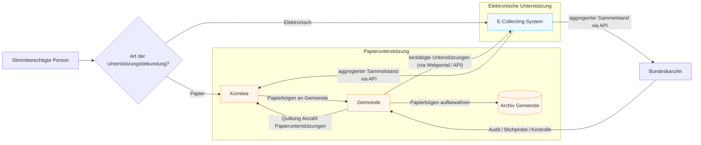
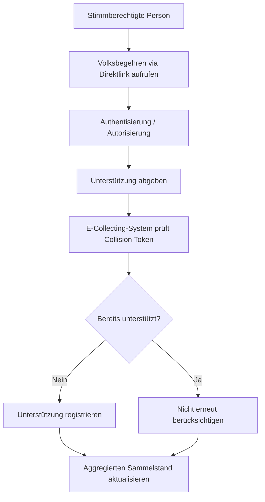
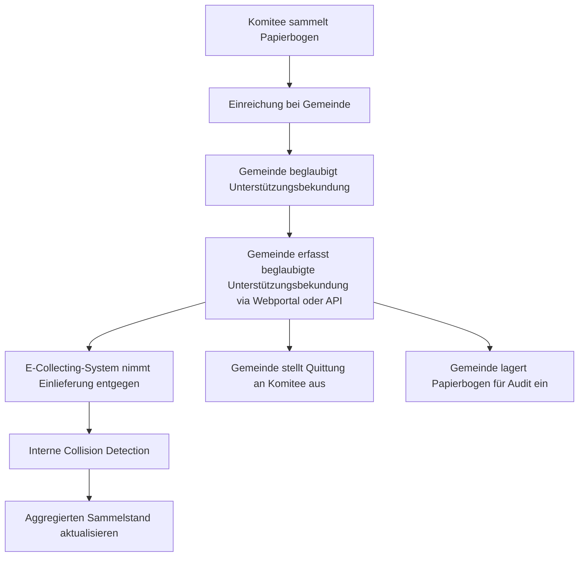
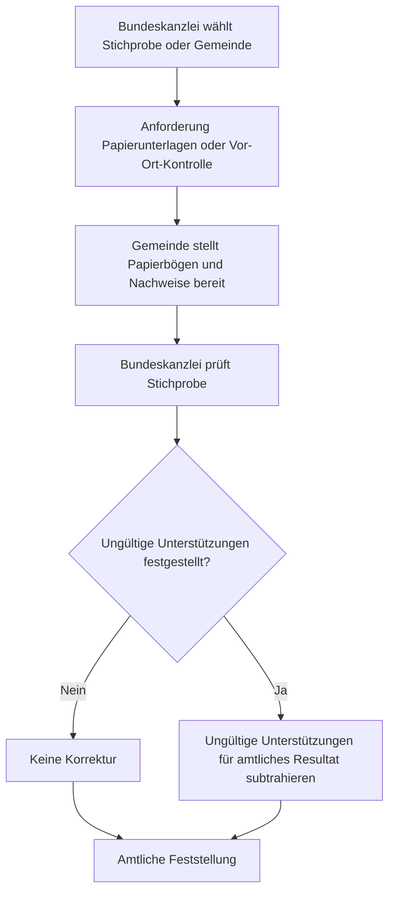

## Umsetzungsvariante: Zentrales E-Collecting-System mit datensparsamer Collision Detection

> **Hinweis zum Status:** Dies ist ein **Vorschlag einer teilnehmenden Person** im Rahmen des partizipativen Prozesses – kein Dokument der Bundeskanzlei. Er beschreibt **eine konkrete Umsetzungsvariante** im Sinne des [Morphologischen Kastens](../method/morphological-box.md): Pro Parameter wird eine Ausprägung gewählt, woraus sich ein zusammenhängendes Zielbild ergibt. Der Vorschlag dient als Diskussionsgrundlage und als Beispiel, wie eine Variante über alle Parameter hinweg ausgestaltet werden könnte.

Das Dokument ist bewusst zuerst entlang der fachlichen Artefakte (Zielbild, Architektur, Prozesse) aufgebaut. Erst danach – in [Teil D](#teil-d--abbildung-auf-den-morphologischen-kasten) – wird gezeigt, **wie dieser Vorschlag auf die einzelnen Parameter und Ausprägungen des Morphologischen Kastens abbildet**.

---

## Teil A – Konzept

### 1. Zielbild

Das E-Collecting-System stellt eine zentrale Plattform für digitale und papierbasierte Unterstützungsbekundungen bereit.

Die Plattform besteht aus:

- einem zentralen E-Collecting-System,
- einem Webportal für Gemeinden ohne eigene Fachanwendung,
- einer API für Gemeinden mit eigenem GEVER- oder Fachsystem.

Das System stellt jederzeit den aktuellen kanalübergreifenden Sammelstand eines Volksbegehrens bereit – maschinenlesbar über die API, ohne eigenes Dashboard.

Die ausgewiesenen Zahlen dienen der operativen Transparenz während der Sammlung und stellen **kein amtlich bestätigtes Endresultat** dar.

### 2. HERMES-Einordnung

Der Vorschlag kann im Sinne von HERMES als Ergebnis der Initialisierungs- bzw. Konzeptphase verstanden werden. Die technische Architektur wird aus den fachlichen Prozessen abgeleitet.

Relevante Ergebnisobjekte:

- Projektskizze / Zielbild
- Stakeholder- und Systemkontext
- Geschäftsprozesse
- Lösungsarchitektur
- Schnittstellenkonzept
- Datenschutz- und Sicherheitsanforderungen
- Audit- und Nachweiskonzept

### 3. Grundprinzip

Das zentrale E-Collecting-System ist die führende Instanz für die Verhinderung von Doppelunterstützungen.

Unabhängig davon, ob eine Unterstützungsbekundung digital oder auf Papier erfolgt, wird zentral entschieden, ob für ein bestimmtes Volksbegehren bereits eine Unterstützungsbekundung derselben stimmberechtigten Person registriert wurde. Im digitalen Kanal erfolgt dies unmittelbar, kanalübergreifend (Papier ↔ digital) über einen datenschutzfreundlichen Abgleich (siehe Abschnitt 5).

Dadurch entfällt die Notwendigkeit für Gemeinden, gegenseitig oder gegenüber dem digitalen Kanal Abfragen durchzuführen.

### 4. Datenschutz und Datensparsamkeit

Die Doppelunterstützungsprüfung soll möglichst datensparsam erfolgen. Anstelle einer kanalübergreifend auswertbaren Personendatenbank wird eine **ballot-spezifische Collision Detection** angestrebt.

Ziele:

- keine Korrelation über verschiedene Volksbegehren hinweg,
- keine Offenlegung früherer Unterstützungsbekundungen,
- keine Einsicht von Komitees in personenbezogene Daten,
- keine Einsicht von Gemeinden in digitale Unterstützungsbekundungen,
- keine Rückmeldung an Gemeinden darüber, ob eine Kollision aus dem digitalen Kanal stammt.

Das System soll lediglich entscheiden können:

- Unterstützung registrieren, oder
- Unterstützung bereits vorhanden

– ohne weitere Informationen offenzulegen.

Wie ein solches datensparsames, ballot-spezifisches Merkmal konkret realisiert werden kann, wird in Abschnitt 5 eingeordnet; es stützt sich auf bestehende wissenschaftliche Arbeiten und ist vor einer Umsetzung eingehend zu prüfen.

### 5. Multiballot-Casting und Collision Detection

Das System unterstützt Multiballot-Casting: eine Person kann mehrere unterschiedliche Volksbegehren unterstützen, pro Volksbegehren aber nur einmal. Die Erkennung einer Doppelunterstützung erfolgt **ballot-spezifisch** – über ein pro Volksbegehren unterschiedliches, nicht über verschiedene Volksbegehren korrelierbares Merkmal. Privatsphäre über parallele Sammlungen hinweg wird zusätzlich dadurch begünstigt, dass zu jedem Zeitpunkt viele Sammlungen parallel laufen.

Die Plattform erkennt dabei lediglich «Unterstützung registrieren» oder «bereits vorhanden» – ohne Identitäten, frühere Unterstützungen oder den Kanal offenzulegen. Der kanalübergreifende Abgleich (Papier ↔ digital) erfolgt datenschutzfreundlich und kann laufend oder periodisch ausgewertet werden.

Für die konkrete Realisierung dieses Mechanismus – sowohl für die Collision Detection als auch für das Multiballot-Casting – bestehen bereits **wissenschaftlich ausgearbeitete Ansätze**, auf denen aufgebaut werden kann:

- **[MultiBallot](https://arxiv.org/abs/2605.19312)** (Moser & Louistisserand) – ein verifizierbares, datenschutzfreundliches E-Collecting-Verfahren für den Schweizer Kontext;
- die **[Hackathon-Lösung von Team 6](https://github.com/swiss/e-collecting-hackathon-team6)** – erweitert ein bestehendes, peer-reviewtes e-Voting-Protokoll (LH15) auf hybrides E-Collecting (Papier + digital).

Diese Ansätze sind **nicht Gegenstand dieses Vorschlags**; sie zeigen die Machbarkeit und sind vor einer Umsetzung **wissenschaftlich eingehend zu prüfen** sowie an den E-Collecting-Kontext anzupassen.

### 6. Systemrollen

**Stimmberechtigte Person**
- unterstützt ein Volksbegehren digital,
- sieht keine personenbezogenen Informationen anderer Personen,
- erhält keine Einsicht in interne Prüfprozesse.

**Komitee**
- sammelt Papierunterstützungen,
- reicht Papierbögen bei Gemeinden ein,
- erhält von Gemeinden Quittungen über bearbeitete Papierunterstützungen,
- ruft aggregierte Sammelstände über die API ab,
- erhält keine personenbezogenen Kollisionsinformationen.

**Gemeinde**
- prüft Papierunterstützungen gemäss geltendem Recht,
- nutzt Webportal oder API zur Einlieferung,
- stellt Quittung an Komitee aus,
- bewahrt Papierbögen für Audits auf,
- erhält keine Information darüber, ob eine Person bereits digital unterstützt hat.

**Bundeskanzlei**
- betreibt oder verantwortet das zentrale E-Collecting-System,
- kann Audits durchführen und Stichproben verlangen,
- stellt das amtliche Resultat fest bzw. wirkt an der amtlichen Feststellung mit.

**E-Collecting-System**
- nimmt digitale Unterstützungen entgegen,
- nimmt beglaubigte Papierunterstützungen entgegen,
- verhindert Doppelunterstützungen kanalübergreifend,
- führt datensparsame Collision Detection durch,
- stellt aggregierte Sammelstände über die API bereit,
- trennt operative Zählung vom amtlichen Endresultat.

### 7. Schnittstellen

Die Plattform stellt **genau eine Benutzeroberfläche** bereit: das **Webportal** für Gemeinden ohne eigenes Fachsystem. Alle übrigen Funktionen – Einlieferung, Quittierung und der **Abruf aggregierter Sammelstände** – laufen über die **API**. Ein eigenes Sammelstand-Dashboard gibt es nicht; die aggregierten Zahlen werden maschinenlesbar über die API bereitgestellt und können von berechtigten Stellen (z. B. Komitees, Behörden) abgerufen und dort dargestellt werden.

**Webportal** – für Gemeinden ohne eigenes Fachsystem (einziges UI)
- Erfassung bestätigter Papierunterstützungen,
- Einlieferung an das zentrale System,
- administrative Übersicht über eigene Einlieferungen,
- keine personenbezogene Kollisionsrückmeldung.

**API** – für Gemeinden mit eigenem GEVER- oder Fachsystem sowie für den Abruf aggregierter Zahlen
- maschinelle Einlieferung bestätigter Papierunterstützungen,
- technische Quittierung der Übermittlung,
- Abruf des aggregierten, kanalübergreifenden Sammelstands (mit Vorläufigkeits-Hinweis),
- keine personenbezogene Kollisionsrückmeldung,
- keine Abfragefunktion nach digitalen Unterstützungen einzelner Personen.

---

## Teil B – Architektur

### 8. Systemkontext (C4 / Kontextdiagramm)

---

## Teil C – Prozesse

### 9. Prozess 1: Digitale Unterstützungsbekundung

Die Person ruft ein spezifisches Volksbegehren über einen **Direktlink** auf (es gibt keine zentrale Übersicht, siehe Parameter 2), authentisiert sich über die vorgesehene elektronische Identität und gibt die Unterstützung ab. Das System prüft atomar auf Doppelunterstützung. Es ist **keine Bedenkzeit** vorgesehen; die Unterstützung wird unmittelbar wirksam.

### 10. Prozess 2: Papierunterstützung erfassen

Das Komitee reicht Papierbögen bei der Gemeinde ein. Die Gemeinde prüft gemäss geltendem Recht und liefert die bestätigten Unterstützungen via Webportal oder API ein (**Fire-and-Forget**). Das zentrale System führt intern die datensparsame Collision Detection durch. Die Gemeinde stellt dem Komitee eine Quittung über die Anzahl bearbeiteter Unterstützungen aus und lagert die Papierbögen für ein allfälliges Audit ein.

Die Gemeinde erhält **keine** personenbezogene Rückmeldung darüber,

- ob eine Person bereits digital unterstützt hat,
- ob eine Kollision festgestellt wurde,
- über welchen Kanal eine frühere Unterstützung erfolgt ist,
- wann eine frühere Unterstützung erfolgt ist.

**Quittung gegenüber Komitees:** Die Quittung dient dem Nachweis der Einlieferung und Bearbeitung. Die Verantwortung für ihre Ausstellung verbleibt bei der Gemeinde. Sie enthält keine Aussage darüber, ob einzelne Unterstützungen später im zentralen System wegen Kollisionen oder im Rahmen eines Audits nicht berücksichtigt werden.

**Aufbewahrung der Papierunterlagen:** Die physischen Unterstützungsbögen verbleiben bei der Gemeinde und werden gemäss gesetzlichen Vorgaben für ein allfälliges Audit aufbewahrt; nach Ablauf der Aufbewahrungsfrist werden sie vernichtet. Das zentrale System ersetzt nicht die Aufbewahrung der Originalunterlagen; diese dienen während der Aufbewahrungsfrist als Nachweisgrundlage für Audits oder amtliche Prüfungen.

### 11. Prozess 3: Audit durch Bundeskanzlei

Die Bundeskanzlei kann Stichproben anfordern, Vor-Ort-Kontrollen durchführen und die Übereinstimmung zwischen gemeldeten und vorhandenen Papierunterstützungen prüfen. Werden Papierunterstützungen nachträglich als ungültig beurteilt, werden diese bei der amtlichen Feststellung vom im E-Collecting-System ausgewiesenen Sammelstand abgezogen.

### Sammelstand

Das E-Collecting-System stellt den aktuellen Sammelstand kanalübergreifend und aggregiert über die API bereit (digital und papierbasiert gemeinsam) – ohne eigenes Dashboard. Der Sammelstand ist eine operative Sicht und ausdrücklich **nicht** mit dem amtlichen Endergebnis gleichzusetzen.

Hinweistext, der die ausgewiesenen Zahlen begleitet:

> Der ausgewiesene Sammelstand ist vorläufig. Nach Audit und Prüfung durch die Bundeskanzlei kann die Anzahl der amtlich bestätigten Unterstützungsbekundungen abweichen.

---

## Teil D – Abbildung auf den Morphologischen Kasten

Dieser Abschnitt zeigt, **wie der oben beschriebene Vorschlag auf die einzelnen Parameter abbildet**. Für jeden Parameter wird eine Ausprägung gewählt. Wo der Vorschlag über die bisher dokumentierten Ausprägungen hinausgeht, ist dies mit ⚠ als **Divergenz / ergänzende Ausprägung** gekennzeichnet.

### 12. Übersicht

| Parameter | Gewählte Ausprägung | Begründung (Kurz) | Diskussion |
|-----------|---------------------|-------------------|------------|
| [1.1 Erfassung Papier](../morphological-box/parameter-1-1.md) | **⚠ neue, kombinierte Ausprägung** – Technologieneutrale Erfassung durch Gemeinde via Webportal oder API (kombiniert Ausprägung 2 + 3, **nicht** auf OCR beschränkt) | Erfassung nötig für kanalübergreifende Prüfung; Technologie bewusst offengelassen | [#12](https://github.com/swiss/e-collecting/issues/12) |
| [1.2 Digitale Verarbeitung](../morphological-box/parameter-1-2.md) | **Ausprägung 2** – Prüfung & Blockierung kanalübergreifender Doppelunterzeichnung | Herzstück der Variante | [#13](https://github.com/swiss/e-collecting/issues/13) |
| [1.3 Behandlung Papier](../morphological-box/parameter-1-3.md) | **Ausprägung 3 (präzisiert)** – Verbleib bei Gemeinde: Aufbewahrung für Audit, danach Vernichtung nach Ablauf der Frist | Originalbögen als Nachweisgrundlage für Audit während der Aufbewahrungsfrist | [#14](https://github.com/swiss/e-collecting/issues/14) |
| [2 Darstellung Volksbegehren](../morphological-box/parameter-2.md) | **Ausprägung 1** – Keine zentrale Übersicht; Zugang nur via Direktlink | Darstellung laufender Volksbegehren ist **nicht** Aufgabe der E-Collecting-Plattform | [#15](https://github.com/swiss/e-collecting/issues/15) |
| [3 Argumente](../morphological-box/parameter-3.md) | **Ausprägung 1** – Plattform frei von Argumenten | Strikte Neutralität; keine Inhalte/Argumente auf der Plattform | [#16](https://github.com/swiss/e-collecting/issues/16) |
| [4 Zuordnung](../morphological-box/parameter-4.md) | **Ausprägung 2** – Anzahl pro Sammelorganisation, nur für Organisationen, freiwillig | Datensparsam, erhält heutige Praxis minimal | [#17](https://github.com/swiss/e-collecting/issues/17) |
| [5 Anzeige Sammelstand](../morphological-box/parameter-5.md) | **Ausprägung 3** – Öffentliche Anzeige, mit Vorläufigkeits-Hinweis | Aggregierter kanalübergreifender Stand | [#18](https://github.com/swiss/e-collecting/issues/18) |
| [6 Föderale Ebenen](../morphological-box/parameter-6.md) | **Zielbild: Ausprägung 4** (alle Ebenen + weitere Begehrensformen); **Versuchsbetrieb: Ausprägung 1** (Bundesebene) | Prinzipiell keine föderale Beschränkung nötig; Race-Conditions (z. B. Wegzug) via Zero-Knowledge-Proofs lösbar | [#19](https://github.com/swiss/e-collecting/issues/19) |
| [7 Administrative Voraussetzungen](../morphological-box/parameter-7.md) | **Ausprägung 3** – Automatischer Zugang ohne Anmeldung; **keine administrativen Voraussetzungen** | Zentrale Collision Detection macht ein Opt-Out überflüssig | [#20](https://github.com/swiss/e-collecting/issues/20) |
| [8 Bedenkzeit](../morphological-box/parameter-8.md) | **Ausprägung 1** – Sofortige Übermittlung | Vorschlag sieht sofortige Wirksamkeit vor | [#21](https://github.com/swiss/e-collecting/issues/21) |

### 13. Begründung je Parameter

#### Parameter 1.1 – Erfassung papierbasierter Unterschriften → ⚠ neue, kombinierte Ausprägung

Auch hier weicht der Vorschlag bewusst ab: Die Gemeinde erfasst bestätigte Papierunterstützungen im E-Collecting-System, jedoch **technologieneutral** über Webportal **oder** API. Die Variante kombiniert damit die manuelle Erfassung (Ausprägung 2) und die teilautomatisierte Erfassung (Ausprägung 3), legt sich aber **nicht** auf eine bestimmte Technologie wie OCR fest. Entscheidend ist nicht das Erfassungsmittel, sondern dass überhaupt erfasst wird – nur so lässt sich die kanalübergreifende Doppelprüfung (Parameter 1.2) durchführen. Diese kombinierte, technologieneutrale Ausprägung sollte in den Morphologischen Kasten aufgenommen bzw. dort diskutiert werden.

#### Parameter 1.2 – Digitale Verarbeitung → Ausprägung 2

Die übermittelten Daten dienen nicht nur der Zählung, sondern der **Prüfung und gegebenenfalls Blockierung kanalübergreifender Doppelunterzeichnungen**. Dies ist das Herzstück der Variante. Übermittelt wird nur das für die Doppelprüfung nötige, nicht über Volksbegehren korrelierbare Merkmal – ohne Offenlegung von Identitäten (siehe Abschnitt 5).

#### Parameter 1.3 – Behandlung der Papier-Unterschriften → Ausprägung 3 (präzisiert)

Die Papierbögen **verbleiben bei der Gemeinde** und werden dort **für ein allfälliges Audit aufbewahrt**; **nach Ablauf der Aufbewahrungsfrist werden sie vernichtet**. Das entspricht Ausprägung 3 (Verbleib bei der Gemeinde, Vernichtung nach Frist) und präzisiert sie um den Zweck: Die Frist bemisst sich am Bedarf für Audits, während derer die Originalbögen als Nachweisgrundlage dienen.

#### Parameter 2 – Darstellung laufender Volksbegehren → Ausprägung 1

Die **Darstellung** laufender Volksbegehren ist bewusst **nicht** Aufgabe der E-Collecting-Plattform. Es gibt keine zentrale Übersicht auf der Benutzeroberfläche; der Zugang erfolgt ausschliesslich über **direkte Links** zur Unterstützungsbekundung für ein spezifisches Volksbegehren (z. B. von der Kampagnen- oder BK-Website aus). So bleibt die Plattform auf ihre Kernfunktion – Entgegennahme und Doppelprüfung von Unterstützungen – beschränkt.

#### Parameter 3 – Argumente platzieren → Ausprägung 1

Die E-Collecting-Plattform wird **frei von Argumenten** der Komitees gehalten – es werden weder eigene Argumente publiziert noch Kampagnenseiten verlinkt. Die Plattform bleibt strikt neutral und auf ihre Kernfunktion beschränkt; inhaltliche Information und Meinungsbildung finden ausserhalb der Plattform statt (vgl. die Begründung in [#16](https://github.com/swiss/e-collecting/issues/16)).

#### Parameter 4 – Zuordnung von Unterstützungsbekundungen → Ausprägung 2

Die heutige Praxis – Nachvollziehbarkeit der Sammelleistung pro Organisation – bleibt minimal erhalten: Die **Anzahl** pro Sammelorganisation wird zugeordnet, jedoch **nur für die Organisationen selbst** einsehbar und auf **freiwilliger** Basis. Eine öffentliche Zuordnung (Ausprägung 3) wird zugunsten der Datensparsamkeit nicht gewählt; ein vollständiger Verzicht (Ausprägung 1) wäre die datensparsamste Alternative.

#### Parameter 5 – Anzeige des Sammelstands → Ausprägung 3

Der aggregierte, kanalübergreifende Sammelstand wird **öffentlich verfügbar** gemacht – maschinenlesbar über die API und **ohne eigenes Dashboard** –, versehen mit einem deutlichen **Vorläufigkeits-Hinweis**. Die Darstellung selbst übernehmen berechtigte Stellen (z. B. Komitees, Behörden, Dritte), nicht die Plattform.

#### Parameter 6 – Föderale Ebenen → Zielbild Ausprägung 4, Versuchsbetrieb Ausprägung 1

Aus Sicht des Vorschlags gibt es **keinen grundsätzlichen Grund für eine föderale Beschränkung**: Das zentrale System kann prinzipiell alle drei Ebenen (Bund, Kantone, Gemeinden) sowie weitere Körperschaften und Begehrensformen abdecken (**Zielbild: Ausprägung 4**). Die dabei entstehenden Race-Conditions – etwa der **Wegzug** einer stimmberechtigten Person zwischen den Ebenen – sind aus Sicht des Vorschlags primär eine Frage der kryptografischen Ausgestaltung (Zero-Knowledge-Proofs) und kein prinzipielles Hindernis.

Für den **Versuchsbetrieb** wird der Einsatz dennoch pragmatisch auf **Initiativen und Referenden auf Bundesebene** beschränkt (**Ausprägung 1**), um Komplexität und abweichende rechtliche Gegebenheiten (Ausländerstimmrecht, Stimmrechtsalter 16) zunächst auszuklammern.

Die nachstehende Hervorhebung zeigt **blau** das Zielbild (Ausprägung 4) und **orange** den Versuchsbetrieb (Ausprägung 1).

#### Parameter 7 – Administrative Voraussetzungen → Ausprägung 3

Der Vorschlag sieht **keine administrativen Voraussetzungen** für die Teilnahme vor: **automatischer Zugang ohne vorgängige Anmeldung** (Ausprägung 3) über die vorgesehene elektronische Identität. Das ist möglich, weil die zentrale Collision Detection Doppelunterstützungen kanalübergreifend verhindert und damit **ein Opt-Out aus dem Papierprozess überflüssig** macht. Vorteil: maximale Barrierefreiheit und keine der im schriftlichen Dialog beschriebenen administrativen/rechtlichen Opt-Out-Probleme.

#### Parameter 8 – Bedenkzeit → Ausprägung 1

Der Vorschlag sieht **keine Bedenkzeit** vor: Die Unterstützungsbekundung wird sofort übermittelt und ist unmittelbar wirksam.

---

## Teil E – Abschluss

### 14. Architekturprinzipien

- Zentrale Verhinderung von Doppelunterstützungen
- Datensparsame, ballot-spezifische Collision Detection
- Multiballot-Casting ohne kanalübergreifende Personenoffenlegung
- Keine Offenlegung kanalbezogener Informationen
- Keine Abfragen durch Gemeinden bezüglich digitaler Unterstützungen
- Fire-and-Forget-Einlieferung durch Gemeinden
- Technologieneutrale Erfassung papierbasierter Unterstützungen (Webportal oder API, nicht auf eine bestimmte Technik wie OCR festgelegt)
- Unterstützung von Gemeinden mit und ohne Fachanwendung
- Schlanke Plattform: keine Darstellung laufender Volksbegehren und keine Argumente – Zugang nur via Direktlink
- Genau eine Benutzeroberfläche (Webportal für Gemeinden ohne Fachsystem); alle weiteren Funktionen inkl. Abruf aggregierter Sammelstände laufen über die API – kein eigenes Dashboard
- Föderale Ausbaubarkeit: keine prinzipielle Beschränkung auf eine föderale Ebene; Race-Conditions (z. B. Wegzug) als Frage der kryptografischen Ausgestaltung (Zero-Knowledge-Proofs)
- Föderale Verantwortung für Papierprüfung und Aufbewahrung bleibt erhalten
- Trennung zwischen operativem Sammelstand und amtlichem Endresultat
- Sofortige Wirksamkeit digitaler Unterstützungsbekundungen ohne Bedenkzeit
- Auditierbarkeit über bei Gemeinden aufbewahrte Papierbögen

### 15. Risiken

Fokus: Risiken, die sich aus dieser Variante ergeben (insbesondere aus Fire-and-Forget und dem operativen Sammelstand). Die zentralen Gegenmassnahmen sind das **Audit durch die Bundeskanzlei** (Abschnitt 11), die bei den Gemeinden **aufbewahrten Originalbögen** (Parameter 1.3) und die **Quittung an Komitees** (Abschnitt 10).

| # | Risiko | Auswirkung | Gegenmassnahme / Restrisiko |
| --- | --- | --- | --- |
| R1 | **Erfassung ohne Papiervorlage** – eine in der Gemeinde erfassende Person legt (vorsätzlich oder versehentlich) Papierunterstützungen an, zu denen kein physischer Bogen existiert. Fire-and-Forget liefert keine unmittelbare Gegenprüfung. | Aufblähung des operativen Sammelstands; nicht belegte Unterstützungen fliessen vorerst in die Zählung ein. | Audit der BK (Stichprobe/Vor-Ort) gleicht gemeldete gegen physisch vorhandene Bögen ab → Differenzen werden vom amtlichen Resultat abgezogen; aufbewahrte Originalbögen als Nachweis; Quittung an Komitee als Quervergleich; Protokollierung je erfassendem Konto; Plausibilitäts-/Anomalieüberwachung der Erfassungsmengen je Gemeinde; organisatorisches Vier-Augen-Prinzip. **Restrisiko:** operativer (vorläufiger) Sammelstand bis zum Audit manipulierbar – durch «vorläufig»-Ausweisung entschärft. |
| R2 | **Verfügbarkeit & Integrität der zentralen Plattform** – die zentrale Komponente ist Single Point of Failure und Angriffsziel. | Ausfall der Sammlung; Manipulationsversuche. | Öffentliche Verifizierbarkeit des gewählten Verfahrens (Abschnitt 5); Betriebs- und Sicherheitskonzept; Redundanz und Lastfestigkeit. |

### 16. Offene Punkte

- wissenschaftliche Prüfung und Auswahl des konkreten Verfahrens für Collision Detection und Multiballot-Casting (vgl. [MultiBallot](https://arxiv.org/abs/2605.19312), [Hackathon Team 6](https://github.com/swiss/e-collecting-hackathon-team6))
- kanalübergreifender Abgleich: Zeitpunkt (laufend vs. periodisch) und Sicherstellung, dass Gemeinden keine personenbezogenen Treffer erfahren (Fire-and-Forget)
- Behandlung föderaler Race-Conditions (z. B. Wegzug zwischen Ebenen, siehe Parameter 6)
- rechtliche Grundlage für die zentrale Kollisionsprüfung
- Datenverantwortung zwischen Bund, Kantonen und Gemeinden
- genaue Aufbewahrungsfristen für Papierbögen bis zur Vernichtung (siehe Präzisierung Parameter 1.3)
- genaue Form der Quittung an Komitees
- Verhältnis zwischen operativem Sammelstand und amtlicher Feststellung
- Umgang mit nachträglich invalidierten digitalen Unterstützungen
- Rollen- und Berechtigungskonzept für Webportal und API
- Auditumfang und Auditfrequenz
- Protokollierung und Nachvollziehbarkeit ohne unnötige Personendatenhaltung
